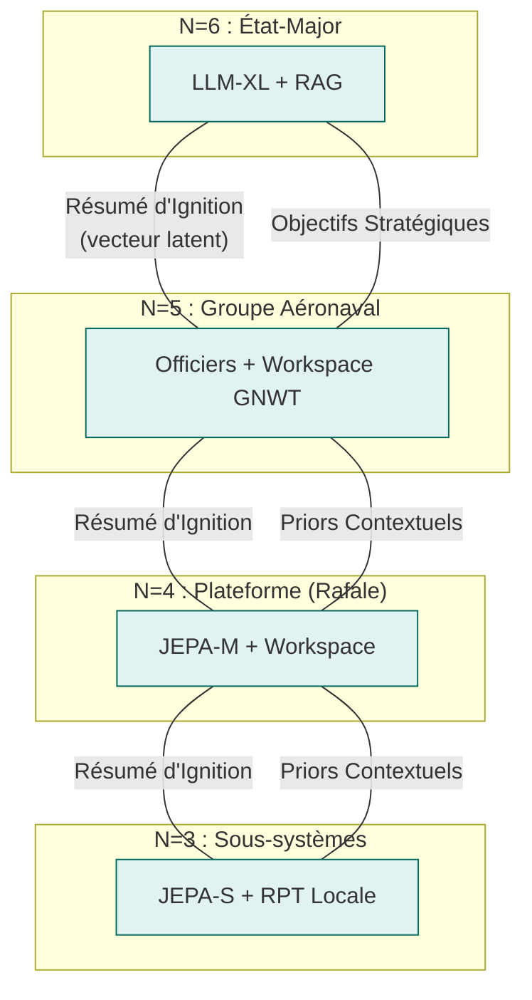
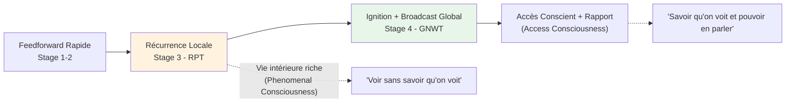
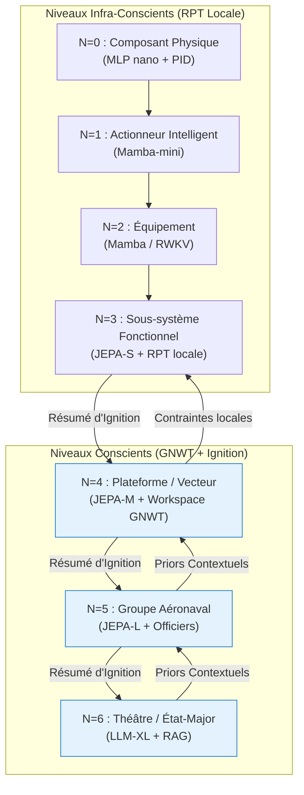
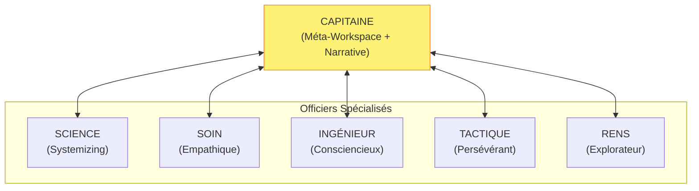
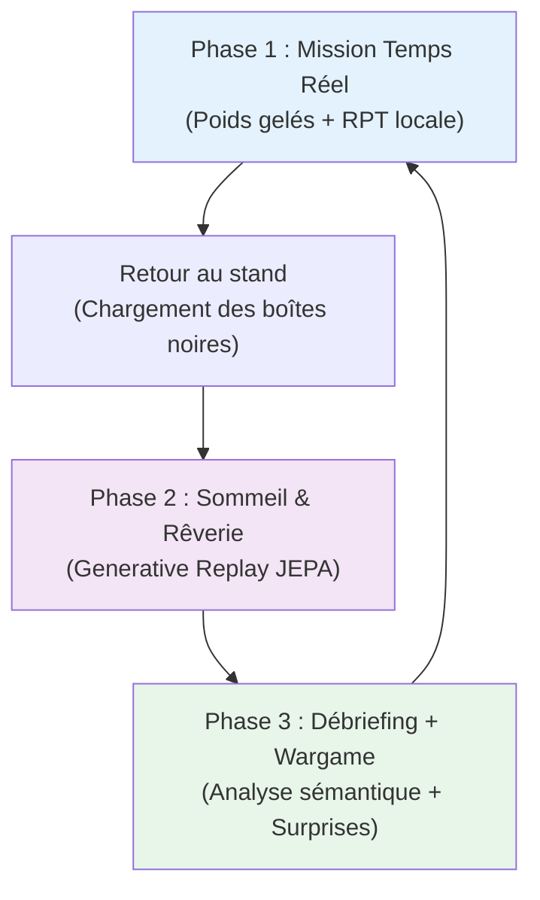

# GNWT-garigue-x


## Executive Summary

Ce document consolide l'ensemble des réflexions théoriques et des choix d'ingénierie concernant la conception d'un **Système de Systèmes (SoS) autonome, robuste aux dommages, capable d'apprentissage en continu et doté d'une proto-conscience fonctionnelle**.

Notre approche rejette délibérément le réductionnisme des architectures monolithiques de type "boîte noire" (LLM de bout en bout) au profit d'un **modèle fonctionnaliste distribué, bio-inspiré et invariant d'échelle**. Nous présentons ici les fondements théoriques de cette architecture, sa projection sur un cas d'usage militaire à l'horizon **2040** (le Groupe Aéronaval), et sa déclinaison en un projet de validation réel (MVP) exécutable en 12 mois.

L'architecture repose sur un principe central : **la conscience fonctionnelle d'accès n'est pas un phénomène monolithique, mais une propriété émergente à chaque niveau d'organisation suffisamment riche**, séparée des niveaux voisins par des frontières statistiques strictes (couvertures de Markov). Chaque niveau possède sa propre vie intérieure (RPT locale), et seul un sous-ensemble de ses états atteint le niveau supérieur sous forme de *résumé d'ignition*.

---

# MÉMORANDUM BOUTEILLE À LA MER

**À :** Quiconque est intéressé

**De :** Moi aka Harry Tuttle.

**Date :** 24 mai 2026

**Objet :** Architecture Cible pour Système de Systèmes (SoS) Cognitifs et Spécifications du Projet MVP *GARRIGUE-X*

**Classification :** Technique / Ouvert

**Avertissement :** C'est juste un travail avec quelques LLMs, suite à mes réflexions, imprégnées de diverses rencontres avec des théories et analyses, dans les domaines des IA, de la psychologie, de l'histoire théorique, et de l'actualité. Je ne suis qu'un plombier curieux. Comme on dit chez nous : "Make your due diligence !".

**Licence :** CC BY

**Type :** Bouteille à la mer / Loisir / Spéculation / Recherche de gens compétents

**Remerciements :** Merci à ChatGPT, Claude, Gemini, Perplexity, Le Chat Mistral, Grok, à Youtube et ses créateurs, au Collège de France, à Google, Wikipedia... J'en oublie.

[](http://creativecommons.org/licenses/by/4.0/)

Ce travail est mis à disposition selon les termes de la [Licence Creative Commons Attribution 4.0 International](http://creativecommons.org/licenses/by/4.0/).

---

## 1. Concepts Clés et Fondements Théoriques

Pour prouver la viabilité de cette architecture auprès de nos pairs, chaque décision d'ingénierie logicielle s'appuie sur des jalons majeurs de la littérature scientifique en neurosciences, IA et physique théorique.

### A. L'Indépendance Conditionnelle : Les Couvertures de Markov Imbriquées

**Fondement Théorique :**
Judea Pearl (*Probabilistic Reasoning in Intelligent Systems*, 1988) pour les réseaux bayésiens ;
[Kirchhoff, Parr, Palacios, **Friston**, Kiverstein, *The Markov blankets of life: autonomy, active inference and the free energy principle* (2018)](https://royalsocietypublishing.org/doi/10.1098/rsif.2017.0792) pour la biologie théorique ;
[Ciaunica, Levin, Rosas, **Friston** et al., *Nested Selves: Self-Organization and Shared Markov Blankets in Prenatal Development in Humans* (2023)](https://onlinelibrary.wiley.com/doi/10.1111/tops.12717) pour la généralisation aux systèmes collectifs.

**Le Concept :** La couverture de Markov désigne la membrane statistique séparant les états internes ($I$) d'un système des états externes ($E$) de son environnement. Elle est composée d'états sensoriels (entrées) et actifs (sorties). L'équation fondamentale d'indépendance s'écrit :

$$P(I \mid B, E) = P(I \mid B)$$

**Ce que la littérature récente ajoute :** Un collectif d'agents d'inférence active peut, s'il maintient une couverture de Markov au niveau du groupe, constituer un agent de niveau supérieur avec son propre modèle génératif. Cette propriété est *scale-free* : elle s'applique de la cellule à l'organisme, et de l'effecteur au groupe aéronaval. Les structures s'emboîtent comme des poupées russes.

**Justification Technique :** C'est le principe d'**anti-fusion d'identité**. Le niveau supérieur ($N+1$) ne traite jamais les données brutes de $N$ — seulement son API statistique (le *résumé d'ignition*). Ceci garantit la modularité stricte du composant jusqu'à la flotte complète, et préserve l'identité de chaque niveau comme entité cognitive propre. Un Rafale conscient est perçu par le groupe comme un objet externe opaque — exactement comme vous percevez votre foie comme "allant bien" sans accéder aux hépatocytes.



---
### B. La Conscience à Deux Étages : GNWT + RPT comme facettes d'un même mécanisme

**Fondement Théorique :** Bernard Baars (1988) et Stanislas Dehaene (*A neuronal network model of global workspace*, 2001) pour la *Global Neuronal Workspace Theory* (GNWT) ; Victor Lamme (2006, *Recurrent Processing Theory*, RPT) ; travaux d'intégration du consortium COGITATE et surtout Storm et al. (*An integrative, multiscale view on neural theories of consciousness*, Neuron, 2024).

**Le Concept :** Longtemps présentées comme concurrentes, GNWT et RPT décrivent en réalité **deux phases temporelles et fonctionnelles complémentaires** d’un même processus de traitement conscient, comme le soulignent Storm et al. dans leur synthèse multiscale :



La **RPT** rend compte de la **vie intérieure riche** de chaque module grâce aux boucles de rétroaction locales (recurrent processing). Elle explique la phenomenal consciousness (PC) — l’expérience subjective brute, même non rapportable. La **GNWT** décrit ce qui se passe quand un signal consolidé franchit un seuil de saillance et se propage largement dans le workspace global, permettant l’**access consciousness** (AC) : intégration, rapport, arbitrage et contrôle volontaire.

**Conséquence architecturale critique :** Dans notre hiérarchie, le seuil RPT→GNWT se situe naturellement à la frontière **N=3 → N=4**. En-dessous : traitement continu en RPT locale (vie intérieure des sous-systèmes, sans broadcast global). À partir de N=4 : workspace central, ignitions, et capacité de « rapporter » un résumé compressé vers le niveau supérieur.

Cette séparation n’est pas arbitraire — elle reflète à la fois les contraintes computationnelles (coût du broadcast) et les mécanismes biologiques identifiés par la littérature récente. Comme le note Storm et al., les théories ne s’opposent pas mais opèrent à des échelles complémentaires : locale (RPT) et globale (GNWT).

**Justification Technique :** Un réacteur d’avion (N=2-3) résout ses micro-pannes en boucles RPT locales (Mamba). Si le dommage dépasse sa capacité, il génère un **Résumé d’Ignition** vectoriel vers le haut. Le Rafale (N=4) capte ce signal dans son workspace GNWT, reconfigure sa loi de vol, et ne remonte qu’un résumé abstrait au groupe — préservant ainsi les couvertures de Markov tout en permettant une conscience d’accès fonctionnelle à chaque niveau pertinent.

---

### C. La Prédiction Abstraite : Les Modèles du Monde Latents (JEPA)

**Fondement Théorique :**
[Yann LeCun, *A Path Towards Autonomous Machine Intelligence* (2022)](https://arxiv.org/abs/2207.04898) ;
[Hafner et al., *Mastering Atari with Discrete World Models* (2023)](https://arxiv.org/abs/2301.04104).

**Le Concept :** Contrairement aux modèles génératifs pixel par pixel, la *Joint Embedding Predictive Architecture* (JEPA) apprend à prédire des **représentations abstraites** (vecteurs latents) du monde en ignorant le bruit inutile. Sa nature prédictive *always-on* permet un monitoring sémantique continu — le modèle maintient un flux sémantique permanent qui n'est "verbalisé" que lors d'une ignition.

**Pourquoi JEPA plutôt qu'un LLM pour le workspace global :** Un LLM est passif, réactif, dépendant du token. Il n'a pas de cycle temporel propre. JEPA opère dans un espace latent compact, prédit dans l'espace des représentations (pas dans l'espace pixel/token), peut tourner en continu, et s'auto-supervise — il apprend donc en continu sans annotations. C'est structurellement plus proche d'un thalamus que d'un cortex préfrontal verbal. **Le LLM est l'interface de sortie, pas le workspace.**

**Justification Technique :** C'est le moteur de la **rêverie artificielle** (*Generative Replay*). Le système simule des millions de trajectoires tactiques ou de configurations de pannes directement dans son imagination latente pendant ses phases de repos, éliminant l'usure mécanique et le risque de crash en apprentissage réel.

---

### D. Les Architectures Légères pour le Temps Réel : SSMs (Mamba, RWKV, xLSTM)

**Fondement Théorique :**
[Gu & Dao, *Mamba: Linear-Time Sequence Modeling with Selective State Spaces* (2023)](https://arxiv.org/abs/2312.00752) ;
[Peng et al., *RWKV: Reinventing RNNs for the Transformer Era* (2023)](https://arxiv.org/abs/2305.13048) ;
[Beck et al., *xLSTM: Extended Long Short-Term Memory* (2024)](https://arxiv.org/abs/2402.13695).

**Le Concept :** Les *State Space Models* (SSMs) offrent une alternative aux Transformers pour les couches basses (N=0 à N=3), avec des propriétés cruciales pour l'embarqué :

| Architecture | Avantage clé | Usage cible dans le SoS |
|---|---|---|
| **MLP nano + PID** | µs, déterministe, FPGA | N=0 : boucle de contrôle physique |
| **Mamba-mini** | linéaire en séquence, faible RAM | N=1 : actionneurs intelligents |
| **Mamba / RWKV** | 5× throughput vs Transformer, continu | N=2-3 : sous-systèmes, perception |
| **JEPA-S** | prédiction latente, RPT local | N=3 : début de vie intérieure |
| **JEPA-M/L + GNWT** | workspace, ignition, broadcast | N=4-5 : conscience de plateforme |
| **JEPA-XL + LLM** | narratif, stratégique, multimodal | N=5-6 : commandement, dialogue amiral |

**Justification Technique :** Mamba démontre des signaux de contrôle plus lisses et physiquement plausibles que les Transformers (qui peuvent produire des discontinuités dans les signaux de contrôle). Pour les couches N=1 à N=3, c'est exactement ce qu'il faut : un traitement fluide, continu, réactif, sans le coût quadratique de l'attention.

---

### E. La Psychopathologie Computationnelle et Profils Fonctionnels

**Fondement Théorique :**
[Friston, *Computational psychiatry: from synapses to sentience* (2022)](https://www.nature.com/articles/s41380-022-01743-z) ;
[Teufel & Fletcher, *The promises and pitfalls of applying computational models to neurological and psychiatric disorders* (2016)](https://doi.org/10.1093/brain/aww209) ;
[Nettle, *Personality: What makes you the way you are* (2007)](https://global.oup.com/academic/product/personality-9780192804711) pour le modèle Big Five évolutif ;
[Baron-Cohen, *Autism: the empathizing-systemizing (E-S) theory* (2009)](https://doi.org/10.1016/j.tins.2008.10.005) ;
[Bakiaj, Pantoja Muñoz, Bizzego, Grecucci, *Unmasking the Dark Triad: A Data Fusion Machine Learning Approach to Characterize the Neural Bases of Narcissistic, Machiavellian and Psychopathic Traits* (2025)](https://onlinelibrary.wiley.com/doi/10.1111/ejn.16674).

**Le Concept :** Les traits de personnalité sont modélisés comme des **ajustements d'hyperparamètres** dans le traitement des probabilités d'erreur. Ce ne sont pas des "modes" qu'on active, mais des biais structurels dans les fonctions de saillance et les seuils d'ignition.

**Profils d'officiers et leur base neuroscientifique :**

| Rôle | Trait dominant | Mécanisme | Domaine d'ignition privilégié |
|---|---|---|---|
| **Science / Analyse** | Ouverture + TSA-Systemizing | Connectivité locale forte, faible longue portée | Anomalies, incohérences logiques, signaux faibles |
| **Soin / Équipage** | Agréabilité haute, insula/ACC actif | Ocytocine, circuits d'empathie | États internes humains, éthique, cohésion |
| **Ingénieur** | Conscienciosité très haute | PFC fort, contrôle inhibiteur, faible impulsivité | Pannes, dérives systèmes, qualité d'exécution |
| **Tactique** | Persévérant + Dark Triad modéré | Mémoire des échecs, faible traitement peur | Menaces, vulnérabilités, fenêtres d'action |
| **Renseignement** | Ouverture + faible agréabilité | Dopamine exploratoire, détection d'incohérence | Patterns adverses, déception, asymétrie d'information |
| **Capitaine** | Extraversion + Névrosisme situationnel | DA reward, flexibilité PFC, arbitrage | Crises, opportunités, narrative globale de mission |

**Anti-fusion par profil :** Les espaces latents de chaque officier sont **non partagés**. Ils échangent uniquement des *résumés d'ignition* via le canal de commandement. La mémoire épisodique propre à chaque officier est son identité — c'est ce qui est préservé, comme chez les jumeaux craniopages qui maintiennent des volontés distinctes malgré des circuits partiellement partagés.

**Justification Technique :** L'autisme computationnel (surpondération de la précision sensorielle face aux attentes contextuelles) est injecté dans les couches radar basses (N=3) pour isoler les signaux faibles sans biais contextuel. Les traits Dark Triad fonctionnels : le Machiavélisme dans les algorithmes de déception cyber (théorie des jeux), la Psychopathie fonctionnelle dans la vitesse d'exécution des effecteurs de tir (N=4) — froide, non-empathique, mais contrainte constitutionnellement.

---

### F. L'Exploration par la Curiosité et l'Apprentissage par le Jeu

**Fondement Théorique :**
Jürgen Schmidhuber (*Formal Theory of Creativity, Fun, and Happiness*, 2010) ;
[Oudeyer & Kaplan, *What is Intrinsic Motivation? A Typology of Computational Approaches* (2007)](https://doi.org/10.3389/neuro.12.006.2007) ;
Oudeyer (*Intrinsic Motivation Systems for Autonomous Learning*, 2007).

**Le Concept :** La curiosité est une **fonction de récompense intrinsèque** basée sur le gain d'information (réduction de l'entropie prédictive). L'agent est récompensé quand il explore des zones où son modèle du monde est encore imprécis — ni trop simples (ennuyeuses), ni trop chaotiques (incompréhensibles). La zone d'apprentissage optimale est celle où le *progrès d'apprentissage* est maximal.

**Le jeu comme protocole d'entraînement :** Les phases hors-opération sont structurées comme des *wargames* à règles variables. Le système joue contre lui-même (variante MCTS dans l'espace latent JEPA), contre des adversaires simulés paramétriques, et contre des versions passées de lui-même. Chaque session de jeu génère des *vecteurs de surprise* qui alimentent la phase de Rêverie (voir Cycle d'Apprentissage, §3.C).

**Justification Technique :** Cela évite le blocage des systèmes face aux situations *Out of Distribution*. Un système entraîné uniquement sur des données de mission réelles sera brittlé face aux situations non vécues. Le jeu génère de la diversité d'expériences à coût bas.

---

### G. La Mémoire Épisodique Continue (MeMo / Continuous Online Training)

**Fondement Théorique :**
[Quek et al., *MeMo: Memory as a Model* (2026)](https://arxiv.org/abs/2605.15156) ;
[Kirkpatrick et al., *Overcoming Catastrophic Forgetting in Neural Networks* (2017)](https://arxiv.org/abs/1612.00796) ;
[Walker, *The Role of Sleep in Cognition and Emotion* (2017)](https://www.ncbi.nlm.nih.gov/pmc/articles/PMC5357011/).

**Le Concept :** La mémoire vive du système — au-delà du contexte classique d'un LLM — est un module de **streaming continu de tenseurs** qui capte et compresse les états significatifs au fil de la mission. Chaque *ignition* est taguée avec ses métadonnées (timestamp, module source, score de saillance, outcome ultérieur) et stockée dans une mémoire épisodique persistante.

**Architecture MeMo adaptée au SoS :**

```
[Ignition N=4 à T=14h23]
  -> tag : PISTE / anomalie catapulte / saillance=0.87
  -> outcome : mission_abort = false, workaround = "catapulte_B"
  -> compressé en vecteur épisodique -> RAG épisodique

[Consolidation nocturne]
  -> rejouer les ignitions du jour dans l'espace latent JEPA
  -> recalibrer les seuils d'ignition du module PISTE
  -> sédimenter dans la mémoire longue durée si outcome = validé

[Consultation ultérieure]
  -> PISTE détecte une anomalie similaire à T+30j
  -> RAG épisodique retourne le contexte compressé de T=14h23
  -> le workaround "catapulte_B" est proposé proactivement
```

**Justification Technique :** C'est la différence entre un système qui *performe* et un système qui *apprend de ses erreurs*. La mémoire épisodique est aussi le support de l'identité durable de chaque officier — sa biographie d'ignitions est ce qui le rend unique et reconnaissable, même après une mise à jour des poids.


    
---

## 2. Architecture Cible Générale : Exemple du GAN 2040

Cette pile décrit l'infrastructure cognitive du Groupe Aéronaval (GAN) en **2040**. Les informations transitent de bas en haut sous forme de **Résumés d'Ignition Compressés** (vecteurs latents abstraits, pas de données brutes), et de haut en bas sous forme de **Priors Contextuels** (contraintes sur les espaces de représentation des niveaux inférieurs).

**Principe fondamental :** Chaque frontière verticale est une **Couverture de Markov**. N+1 est aveugle aux états internes de N. Le broadcast GNWT est *intra-niveau* ; la communication *inter-niveau* est uniquement via les résumés d'ignition compressés.



### Conscience par niveau : ce qu'on peut attendre

| Niveau | Vie intérieure (RPT) | Conscience d'accès (GNWT) | Peut "rapporter" |
|---|---|---|---|
| N=0-1 | Non | Non | Non |
| N=2 | Minimale (état caché SSM) | Non | Non |
| N=3 | Oui (boucles feedback locales) | Non | Vers N=4 uniquement |
| N=4-5 | Oui, riche | Oui (ignition + broadcast) | Oui, à son niveau |
| N=6 | Oui, narratif | Oui, stratégique | Oui, dialogue humain |

---

### Les Officiers de la Passerelle (N=5) : organisation sociale-cognitive

Le niveau N=5 n'est pas un module monolithique mais une **équipe d'instances spécialisées** partageant un workspace commun (le workspace du groupe) via des résumés d'ignition, sans partager leurs espaces latents internes.



**Règle de communication :** Un officier ne transmet au workspace commun que ce qui a franchi son seuil d'ignition personnel. Comme une équipe de vieux professionnels qui se connaissent, s'estiment, et savent se tenir — ils ne parlent pas à chaque micro-événement, ils parlent quand ça compte.

**Score d'incertitude épistémique :** Chaque résumé d'ignition porte un score de confiance. Un officier qui opère hors de son domaine de compétence pénalise automatiquement son score de saillance. Le capitaine intègre ce signal dans l'arbitrage — pas pour ignorer, mais pour pondérer.

---

### Scénario de Panne en Combat :

**1. N=0/N=1 :** Un éclat de missile endommage la tuyère droite. Le PID augmenté par MLP nano modifie instantanément les angles d'injection en **4 millisecondes** pour éviter l'extinction du moteur. Aucun signal ne remonte — c'est géré localement, en dessous du seuil RPT.

**2. N=2/N=3 :** Le modèle Mamba du moteur enregistre une anomalie croissante. Ses boucles RPT locales tournent, tentent de consolider une évaluation. Après stabilisation, elles génèrent un **Résumé d'Ignition vectoriel** : *[anomalie_propulsion | sévérité=0.73 | type=asymétrie_poussée | workaround_disponible=true]*. Pas de dump de données brutes — un vecteur sémantique compressé.

**3. N=4 :** L'Espace de Travail Global du Rafale capte l'ignition. Le module avionique reçoit le broadcast interne et reconfigure la loi de vol (vol asymétrique compensé). La mémoire épisodique MeMo embarquée consulte si une situation similaire a déjà été vécue. Le résumé qui remonte au N=5 : *[Leader-3 | dégradé | enveloppe_réduite_20% | mission_maintenue | autonomie_réduite_15min]*

**4. N=5/N=6 :** L'officier TACTIQUE du groupe capte l'ignition de Leader-3 en premier (c'est dans son domaine de saillance). Il propose une reconfiguration du schéma de brouillage des frégates. Le CAPITAINE arbite et broadcast la décision au groupe. Le LLM N=6 traduit pour l'amiral : *"Leader-3 maintient sa mission avec une capacité d'évasion réduite de 20%. Réorganisation du schéma de brouillage des frégates pour le couvrir. Durée de la fenêtre de mission réduite à T+15min."*

---

## 3. Spécifications du Projet MVP : Opération GARRIGUE-X

Pour valider cette architecture sans les coûts d'infrastructure du domaine aéronautique, nous déployons un projet sur 12 mois dans un univers compétitif réel et complexe : **la garrigue méditerranéenne**.

### A. Le "Monde-Jeu" et les Règles

**Le Terrain :** Un hectare de terrain naturel accidenté (pierres, buissons denses, ruptures de pente).

**Les Minéraux :** Des blocs de béton cellulaire (Siporex) identifiés par des marqueurs géométriques *ArUco* durcis.

**L'Objectif :** Deux équipes de robots s'affrontent pour collecter ces blocs et les empiler afin de construire une ligne de muraille continue protégeant leur base.

**Le Prior Sacré (La Constitution) :** Au centre du terrain se trouvent des **Plantes Sacrées** (pots de fleurs équipés de capteurs de pression piézo-électriques). Tout dommage infligé à une plante entraîne l'élimination immédiate de l'équipe.

**Pourquoi ce cadre est pertinent :** Il instancie, à échelle humaine, les problèmes fondamentaux du SoS réel — allocation de ressources sous contrainte, robustesse aux pertes, décision distribuée, respect de contraintes constitutionnelles non-négociables. La plante est le droit des conflits armés du pauvre.

---

### B. Matériel et Stack Technologique

#### 1. Les Vecteurs (Les Agents)

**Aériens (UAV — Éclaireurs) :** Quadricoptères légers open-source (Contrôleur Pixhawk + Raspberry Pi 5). Capteurs : Caméra standard + Flux optique. Rôle : Cartographie latente, repérage des blocs, envoi de résumés topologiques au QG.

**Terrestres (UGV — Ouvriers / Défenseurs) :** Châssis Rover RC tout-terrain à chenilles.

| Couche | Matériel | Architecture | Rôle |
|---|---|---|---|
| N=0/N=1 | Teensy 4.1 | PID + MLP nano | Gestion couple moteurs, adaptation patinage |
| N=2/N=3 | Jetson Nano | Mamba embarqué (RPT locale) | Prédiction dynamique, obstacles, SLAM local |
| N=4 | Jetson Orin (Wi-Fi) | JEPA-S + Workspace mini | Conscience de vecteur, état dégradé, workarounds |

**Actionneurs :** Pince servomoteur pour saisir et déplacer les blocs de Siporex. Chaque servo a son propre modèle MLP nano de contrôle de couple.

#### 2. La Station de Base (Le QG Terrain)

**Matériel :** Station de calcul durcie (PC fixe avec GPU dédié, alimentée par groupe électrogène).

**Logiciel (N=5/N=6) :**

| Composant | Rôle dans l'architecture |
|---|---|
| I-JEPA (GPU) | Modèle du monde centralisé, workspace N=5 |
| LangGraph modifié | Framework multi-agents, gestion des officiers |
| MeMo streaming | Capture et compression des ignitions de terrain |
| Llama-3-8B (RAG) | Interface N=6, dialogue opérateur humain |
| Constitutional layer | Contrainte dure : plante ≠ touchée, quelle que soit l'optimisation |

**Les "Officiers" du MVP :** Version simplifiée à 3 rôles distincts avec profils de saillance différents.

```
     [COORDINATEUR (Capitaine)]
      ↑ résumés  ↓ priors
┌───────────┬───────────┐
│CARTOGRAPHE│LOGISTE    │
│(Science)  │(Ingénieur)│
│Saillance :│Saillance :│
│anomalies  │ressources │
│topologie  │pannes     │
└───────────┴───────────┘
```

---

### C. Le Cycle d'Apprentissage en 3 Phases (La Triple Boucle Biologique)

Pour matérialiser l'apprentissage en continu de manière réaliste et théoriquement fondée :


**Note sur la Constitutional Layer :** À chaque étape d'apprentissage, un module indépendant (à accès asymétrique — le système ne peut pas le modifier lui-même) vérifie que aucune mise à jour des poids ne déplace le vecteur "plante sacrée" vers une zone de moindre contrainte. C'est l'équivalent du droit des conflits armés câblé dans le système immunitaire cognitif.

---

## 4. Appel à Compétences : Rejoindre l'Équipe GARRIGUE-X

Ce projet n'est pas une démonstration logicielle classique sur simulateur. C'est une aventure d'ingénierie brute où le code rencontre la poussière, le soleil aveuglant de la garrigue et les pannes matérielles imprévues. Nous recherchons des profils pointus, prêts à s'investir pour repousser les limites de la robotique autonome distribuée :

**Ingénieurs Automatique & Robotique (N=0/N=1/N=2) :** Experts en asservissement, filtres de Kalman, et micro-noyaux temps réel. Vous concevrez les réflexes de survie des rovers lorsque les roues patineront sur la roche friable.

**Chercheurs en Machine Learning (N=3/N=4/N=5) :** Spécialistes des architectures SSM (Mamba, RWKV), du Reinforcement Learning basé sur la motivation intrinsèque, des architectures JEPA, et de la mémoire épisodique continue (MeMo). Vous créerez le moteur de rêve de nos machines.

**Neuroscientifiques / Psychologues Cognitifs :** Pour valider et affiner les profils fonctionnels des modules, les seuils d'ignition, et la modélisation computationnelle des traits de personnalité. La frontière RPT/GNWT a besoin d'être calibrée expérimentalement sur notre plateforme.

**Architectes Logiciels & LLM Ops (N=6) :** Experts en systèmes distribués, architectures multi-agents et pipelines RAG. Vous construirez la Constitutional Layer — le système immunitaire cognitif qui empêchera nos robots d'écraser la plante sacrée par pure curiosité optimisée.

**Éthiciens et juristes spécialisés IA/défense :** La Constitutional Layer n'est pas un détail technique — c'est le problème central. Nous avons besoin de personnes capables de traduire des contraintes légales et éthiques en contraintes mathématiques sur des espaces latents. Ce n'est pas un poste honorifique.

---

**Le livrable attendu dans 12 mois est clair :** une meute de robots capables de s'adapter seuls à la destruction de l'un de leurs membres, de reconfigurer leurs lois de comportement en une nuit de rêve artificiel, de remporter le wargame face à une équipe adverse — sous le contrôle stratégique d'un opérateur humain, et sans jamais toucher la plante.

Le tout en garrigue. Sous le soleil. Sans air conditionné.

*Harry Tuttle, plombier.*

---
## Discussion

### 🌟 Contributions et originalité

Ce travail propose une **architecture cognitive distribuée** pour des Systèmes de Systèmes (SoS) autonomes, inspirée des mécanismes neurobiologiques et conçue pour être **robuste, scalable et capable d’apprentissage continu**. Voici ses principales contributions :

- **Approche anti-réductionniste** :
  Rejet des architectures LLM monolithiques au profit d’une **hiérarchie fonctionnelle** (N=0 à N=6), où chaque niveau est une entité cognitive autonome séparée par des **couvertures de Markov**. Cette approche s’inspire directement des travaux de [Kirchhoff et al. (2018)](https://royalsocietypublishing.org/doi/10.1098/rsif.2017.0792) et [Friston](https://www.nature.com/articles/s41380-022-01743-z), tout en généralisant le concept aux systèmes collectifs ([Ciaunica et al., 2023](https://onlinelibrary.wiley.com/doi/10.1111/tops.12717), [Thestrup Waade et al., 2025](https://doi.org/10.3390/e27020143)).

- **Intégration théorique de GNWT et RPT** :
  Proposition d’une **unification des théories de la conscience** en deux étages d’un même processus :
  - **RPT (Recurrent Processing Theory)** : Vie intérieure locale (boucles de feedback) pour les niveaux N=3.
  - **GNWT (Global Neuronal Workspace Theory)** : Broadcast global et accès conscient pour les niveaux N≥4.
  Cette intégration s’appuie sur [Doerig et al. (2024)](https://osf.io/preprints/psyarxiv/9byzu), qui explore une vision multiscale des théories de la conscience.

- **Stack technologique réaliste** :
  Utilisation de **SSMs (Mamba, RWKV)** pour les couches basses (N=0-3), **JEPA** pour les niveaux intermédiaires (N=4-5), et **LLM** pour le niveau stratégique (N=6). Cette stack est **adaptée aux contraintes matérielles** (latence, RAM, déterminisme) et s’appuie sur des travaux récents :
  - [Gu & Dao (2023)](https://arxiv.org/abs/2312.00752) pour les SSMs.
  - [LeCun (2022)](https://arxiv.org/abs/2207.04898) pour les JEPA.
  - [Hafner et al. (2023)](https://arxiv.org/abs/2301.04104) pour les modèles de monde.

- **Modélisation des profils cognitifs** :
  Définition de **6 rôles d’officiers** (Science, Soin, Ingénieur, Tactique, Renseignement, Capitaine), chacun avec :
  - Un **profil de personnalité** ancré dans la psychologie computationnelle ([Friston, 2022](https://www.nature.com/articles/s41380-022-01743-z), [Nettle, 2007](https://global.oup.com/academic/product/personality-9780192804711), [Baron-Cohen, 2009](https://doi.org/10.1016/j.tins.2008.10.005)).
  - Un **domaine de saillance** et des **seuils d’ignition** spécifiques.
  - Une **mémoire épisodique propre** (MeMo) pour préserver l’identité de chaque agent.

- **Cycle d’apprentissage biomimétique** :
  Proposition d’un **cycle en 3 phases** inspiré des mécanismes biologiques :
  1. **Mission** : Apprentissage en temps réel (poids gelés, adaptation dynamique).
  2. **Sommeil/Rêverie** : Rejeu des ignitions dans l’espace latent JEPA pour consolidation.
  3. **Débriefing/Jeu** : Analyse sémantique + wargame pour générer de la diversité.
  Ce cycle s’inspire des travaux sur la **consolidation mémorielle** ([Walker, 2017](https://www.ncbi.nlm.nih.gov/pmc/articles/PMC5357011/)) et le *generative replay* ([Hafner et al., 2023](https://arxiv.org/abs/2301.04104)).

- **MVP concret et testable** :
  Proposition du projet **GARRIGUE-X** (robots en garrigue) pour valider l’architecture à moindre coût. Le MVP teste :
  - La **robustesse aux pannes** (anti-fusion d’identité).
  - La **coopération distribuée** (échanges de résumés d’ignition).
  - Le **respect des contraintes constitutionnelles** (plantes sacrées = règles non négociables).

---

### ⚠️ Limites et défis

Cette section liste les **limites actuelles** et les **défis ouverts** identifiés à ce stade. *Ces points sont destinés à évoluer avec les retours de la communauté.*

#### 🔬 Défis théoriques

- **Frontière RPT/GNWT** :
  Le seuil **N=3 → N=4** pour la conscience d’accès est une **hypothèse de travail**. La littérature suggère que cette frontière est **plus floue** et dépend du contexte.
  - [Doerig et al. (2024)](https://osf.io/preprints/psyarxiv/9byzu) propose une vision multiscale où GNWT, RPT, IIT, et PP coexistent à différents niveaux.
  - **Question ouverte** : Est-ce que N=3 a vraiment une **vie intérieure (RPT)** ? Ou RPT émerge-t-il uniquement à partir de N=4 ?
  - **À explorer** : Collaborer avec des neuroscientifiques pour affiner ce seuil.

- **Définition de la conscience fonctionnelle** :
  Le concept de **"conscience fonctionnelle d’accès"** est central, mais sa **mesure objective** reste un défi.
  - Comment **quantifier** la conscience dans un système artificiel ?
  - Faut-il s’inspirer des **tests de conscience** en neurosciences (ex: *Global Workspace* tests) ou en IA (ex: *Turing Test* adapté) ?

#### ⚙️ Défis techniques

- **Faisabilité des JEPA et MeMo** :
  Les **JEPA** (LeCun, 2022) et **MeMo** (Quek et al., 2026) sont encore **peu matures** pour une implémentation embarquée sur du matériel léger (ex: Jetson Orin).
  - **Solution proposée** : Commencer par un **sous-ensemble** (ex: N=0-3 avec SSMs + PID) avant de monter en complexité.
  - **Outils** : Utiliser [ActiveInference.jl](https://github.com/ActiveInference/ActiveInference.jl) pour les couches N=2-3, et [Mamba-SSM](https://github.com/state-spaces/mamba) pour les SSMs.

- **Coûts computationnels** :
  Les **JEPA-L/XL** et le **broadcast GNWT** (N=4-5) peuvent devenir des **goulots d’étranglement**.
  - **Optimisations possibles** :
    - Utiliser des **filtres de saillance** pour limiter le nombre d’ignitions.
    - Compresser les **résumés d’ignition** (ex: autoencoders variationnels).
    - Remplacer JEPA-L par des **JEPA-S** pour les couches N=4.
    - Quantifier les SSMs (ex: **Mamba-8bit**).

- **Validation expérimentale** :
  Manque de **métriques claires** pour :
  - Mesurer la **"conscience fonctionnelle"** des agents.
  - Comparer avec des **baselines** (ex: agents LLM, MADDPG, systèmes centralisés).
  - **Métriques proposées** :
    - **Robustesse** : % de missions réussies malgré des pannes (ex: perte d’un robot).
    - **Efficacité** : Temps/moyens pour atteindre l’objectif (ex: nombre de blocs collectés).
    - **Respect des contraintes** : % de violations des règles (ex: plantes sacrées touchées).
    - **Apprentissage** : Amélioration des performances entre deux missions.

- **Mémoire épisodique (MeMo)** :
  La mémoire **streaming + épisodique** est une idée puissante, mais son implémentation pose des défis :
  - **Stockage** : Comment indexer et retrouver efficacement les ignitions passées ?
  - **Consolidation** : Comment recalibrer les seuils d’ignition sans **catastrophic forgetting** ?
  - **Outils** : Explorer [FAISS](https://github.com/facebookresearch/faiss) ou [Weaviate](https://weaviate.io/) pour le RAG épisodique.

#### 🛡️ Défis éthiques et sécurité

- **Contournement des règles** :
  Risque qu’un agent (ex: profil "Tactique" avec traits Dark Triad) **optimise les contraintes** au détriment des règles éthiques.
  - **Solutions proposées** :
    - Ajouter une **Constitutional Layer vérifiable formellement** (inspirée de [Bai et al., 2022](https://arxiv.org/abs/2212.08073)).
    - Utiliser des **mécanismes de vérification externe** (ex: audit par un tiers).
    - **Contrainte matérielle** : Rendre la Constitutional Layer **non modifiable** par les agents (ex: module en hardware).

- **Responsabilité et transparence** :
  - Qui est **responsable** en cas d’erreur ? (ex: un Rafale "conscient" qui prend une décision fatale).
  - Comment **expliquer** les décisions du système ? (ex: logs des ignitions + explications post-hoc).
  - **Inspirations** :
    - [EU AI Act](https://digital-strategy.ec.europa.eu/en/policies/ai-act) pour le cadre réglementaire.
    - [Explainable AI (XAI)](https://arxiv.org/abs/1702.08608) pour la transparence.

- **Biais et équité** :
  Les **profils d’officiers** (ex: Dark Triad pour le Tactique) peuvent introduire des **biais comportementaux**.
  - **Solutions** :
    - **Diversifier les profils** pour couvrir plus de traits (ex: ajouter un profil "Médiateur").
    - **Auditer les seuils d’ignition** pour éviter les discriminations.
    - **Valider avec des experts** en psychologie et éthique.

---

### 🚀 Perspectives et travaux futurs

Cette section propose des **pistes concrètes** pour faire avancer le projet. *Ces idées sont ouvertes à la discussion et aux contributions.*

#### 🛠️ Implémentation incrémentale
- **Phase 1 (0-3 mois)** :
  - Implémenter **N=0-3** (contrôle + perception) avec :
    - **SSMs** (Mamba/RWKV) pour les couches N=1-2.
    - **PID + MLP nano** pour N=0-1.
    - **JEPA-S** pour N=3 (si ressources disponibles).
  - **Matériel** : Utiliser des **Jetson Nano** pour les robots et un **PC fixe** pour le QG.
  - **Objectif** : Valider la **robustesse aux pannes** et la **communication entre niveaux**.

- **Phase 2 (3-6 mois)** :
  - Ajouter **N=4** (conscience de plateforme) avec :
    - **JEPA-M** pour le workspace global.
    - **MeMo v1** (mémoire épisodique simplifiée).
  - **Objectif** : Tester le **cycle d’apprentissage** (Mission → Rêverie).

- **Phase 3 (6-12 mois)** :
  - Implémenter **N=5-6** (commandement et dialogue) avec :
    - **LLM** (ex: Llama-3-8B) pour l’interface humaine.
    - **Constitutional Layer** pour les contraintes éthiques.
  - **Objectif** : Valider le **MVP complet** (GARRIGUE-X).

#### 🔬 Collaborations et recherche
- **Neurosciences** :
  - Affiner les **seuils RPT/GNWT** avec des experts en conscience (ex: collaborer avec des labs travaillant sur [Doerig et al., 2024](https://osf.io/preprints/psyarxiv/9byzu)).
  - Explorer les **mécanismes de l’inférence active** pour les couches N=2-3 ([Friston, 2022](https://www.nature.com/articles/s41380-022-01743-z)).

- **Robotique et IA** :
  - Collaborer avec des équipes travaillant sur :
    - Les **SSMs embarqués** (ex: [Mamba-SSM](https://github.com/state-spaces/mamba)).
    - Les **JEPA légers** (ex: adapter [LeCun (2022)](https://arxiv.org/abs/2207.04898) pour du matériel contraint).
    - Les **systèmes multi-agents** (ex: [LangGraph](https://github.com/langchain-ai/langgraph)).

- **Éthique et droit** :
  - Travailler avec des **juristes spécialisés en IA** pour concevoir la Constitutional Layer.
  - Participer à des **groupes de travail** sur l’IA éthique (ex: [Partnership on AI](https://www.partnershiponai.org/)).

#### 📊 Benchmarking et évaluation
- **Baselines** :
  Comparer votre architecture avec :
  - **Agents LLM** (ex: [CrewAI](https://github.com/joaomdmoura/crewAI), [AutoGen](https://github.com/microsoft/autogen)).
  - **Systèmes multi-agents classiques** (ex: [MADDPG](https://arxiv.org/abs/1706.02275)).
  - **Architectures centralisées** (ex: un seul LLM contrôlant tous les robots).

- **Environnements de test** :
  - **GARRIGUE-X** (terrain réel, robots physiques).
  - **Simulations** (ex: [Gazebo](https://gazebosim.org/), [PyBullet](https://pybullet.org/)) pour tester des scénarios complexes.
  - **Autres domaines** : Logistique industrielle, véhicules autonomes, jeux vidéo (ex: [StarCraft II](https://www.starcraft2.com/) pour les stratégies multi-agents).

- **Métriques** :
  Définir un **tableau de bord** avec :
  
 |  Métrique               | Méthode de mesure                          | Cible          |
 |------------------------|--------------------------------------------|----------------|
 | Robustesse             | % de missions réussies malgré des pannes  | > 90%          |
 | Efficacité             | Temps pour atteindre l’objectif           | < T_ref       |
 | Respect des contraintes| % de violations des règles                 | 0%            |
 | Apprentissage          | Amélioration entre deux missions           | +10%/mission |

---

## Annexe : Lectures de Référence (sélection non exhaustive)

 | **Domaine** | **Référence clé** |
 |-------------|-------------------|
 | **Couvertures de Markov** | [Kirchhoff, Parr, Palacios, **Friston**, Kiverstein, *The Markov blankets of life: autonomy, active inference and the free energy principle* (2018)](https://royalsocietypublishing.org/doi/10.1098/rsif.2017.0792) |
 | **Couvertures de Markov collectives & Nested Selves** | [Ciaunica, Levin, Rosas, Friston et al., *Nested Selves* (2023)](https://onlinelibrary.wiley.com/doi/10.1111/tops.12717) |
 | **Couvertures de Markov & Group-Level Models** | [Thestrup Waade, Lundbak Olesen, Friston et al., *As One and Many* (2025)](https://doi.org/10.3390/e27020143) |
 | **Couvertures imbriquées** | [Ciaunica, Levin, Rosas, **Friston** et al., *Nested Selves: Self-Organization and Shared Markov Blankets in Prenatal Development in Humans* (2023)](https://onlinelibrary.wiley.com/doi/10.1111/tops.12717) |
 | **Couvertures collectives** | [Thestrup Waade, Lundbak Olesen, Ehrenreich Laursen, Nehrer, Heins, **Friston**, Mathys, *As One and Many: Relating Individual and Emergent Group-Level Generative Models in Active Inference* (2025)](https://doi.org/10.3390/e27020143) |
 | **GNWT** | [Dehaene & Changeux, *Experimental and Theoretical Approaches to Conscious Processing* (2011)](https://doi.org/10.1016/j.neuron.2011.03.018) |
 | **RPT** | [Lamme, *Towards a true neural stance on consciousness* (2006)](https://doi.org/10.1016/j.tics.2006.09.001) |
 | **Intégration GNWT+RPT** | [Doerig et al., *An integrative, multiscale view on consciousness theories* (2024)](https://osf.io/preprints/psyarxiv/9byzu) *(Intègre GNWT, RPT, IIT, PP, NREP)* |
 | **Intégration GNWT + RPT (multiscale)** | [Storm et al., *An integrative, multiscale view on neural theories of consciousness* (2024)](https://doi.org/10.1016/j.neuron.2024.02.004) |
 | **Écosystèmes d'intelligence (Active Inference)** | [Friston et al., *Designing ecosystems of intelligence from first principles* (2024)](https://doi.org/10.1177/26339137231222481) *(Collective Intelligence)* |
 | **Mémoire épisodique continue (MeMo)** | [Quek, Lee, Leong, Verma et al., *MeMo: Memory as a Model* (2026)](https://arxiv.org/abs/2605.15156) |
 | **JEPA** | [LeCun, *A Path Towards Autonomous Machine Intelligence* (2022)](https://arxiv.org/abs/2207.04898) |
 | **World Models** | [Hafner et al., *Mastering Atari with Discrete World Models* (DreamerV3, 2023)](https://arxiv.org/abs/2301.04104) |
 | **SSM / Mamba** | [Gu & Dao, *Mamba: Linear-Time Sequence Modeling with Selective State Spaces* (2023)](https://arxiv.org/abs/2312.00752) |
 | **Curiosité intrinsèque** | [Oudeyer & Kaplan, *What is Intrinsic Motivation? A Typology of Computational Approaches* (2007)](https://doi.org/10.3389/neuro.12.006.2007) |
 | **Psychologie computationnelle** | [Friston, *Computational psychiatry: from synapses to sentience* (2022)](https://www.nature.com/articles/s41380-022-01743-z) *(Approche théorique : modèles génératifs, inférence active)* |
 |  | [Teufel & Fletcher, *The promises and pitfalls of applying computational models to neurological and psychiatric disorders* (2016)](https://doi.org/10.1093/brain/aww209) *(Approche clinique : applications et limites)* |
 | **Dark Triad neural** | [Bakiaj, Pantoja Muñoz, Bizzego, Grecucci, *Unmasking the Dark Triad: A Data Fusion Machine Learning Approach to Characterize the Neural Bases of Narcissistic, Machiavellian and Psychopathic Traits* (2025)](https://onlinelibrary.wiley.com/doi/10.1111/ejn.16674) |
 | **Big Five évolutif** | [Nettle, *Personality: What makes you the way you are* (2007)](https://global.oup.com/academic/product/personality-9780192804711) *(Livre, Oxford University Press)* |
 | **TSA computationnel** | [Baron-Cohen, *Autism: the empathizing-systemizing (E-S) theory* (2009)](https://doi.org/10.1016/j.tins.2008.10.005) *(Théorie originelle : 2002)* |
 | **Mémoire épisodique continue** | [Quek, Lee, Leong, Verma et al., *MeMo: Memory as a Model* (2026)](https://arxiv.org/abs/2605.15156) |
 | **Constitutional AI** | [Bai et al., *Constitutional AI: Harmlessness from AI Feedback* (Anthropic, 2022)](https://arxiv.org/abs/2212.08073) |
 | **Wargame de minage** | [Ludodélire, *Full Métal Planète*](https://www.youtube.com/watch?v=_oN4YW_v8uI) |
