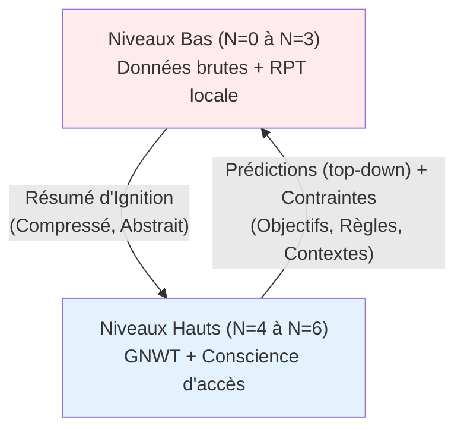
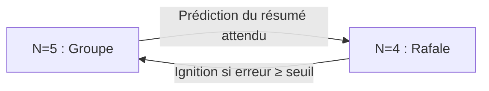
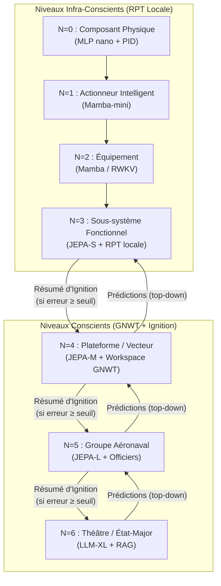
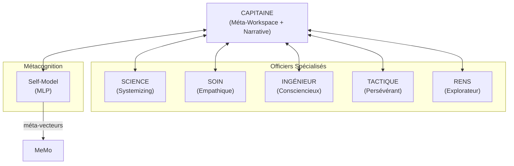
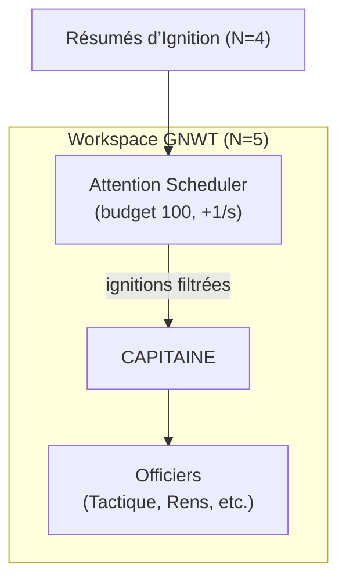
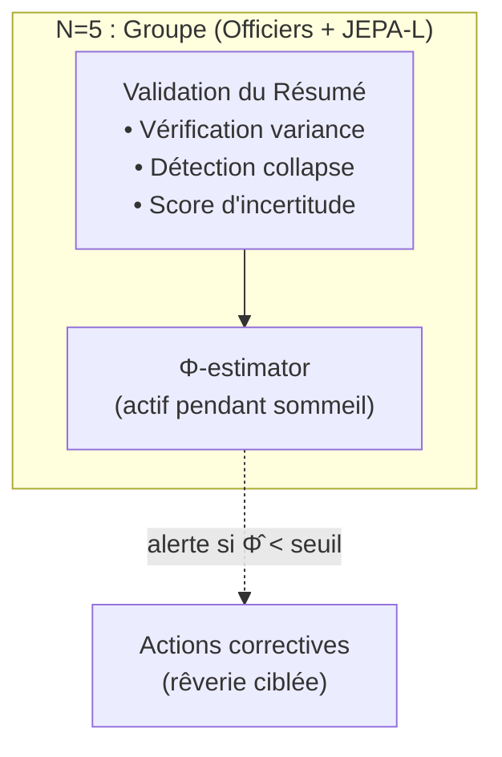
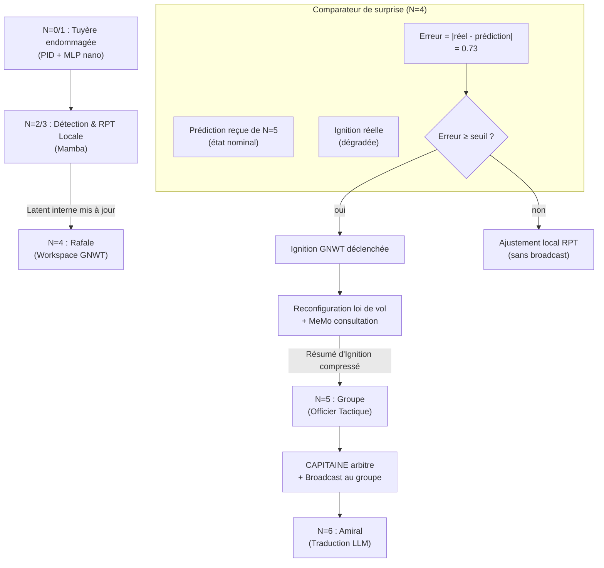
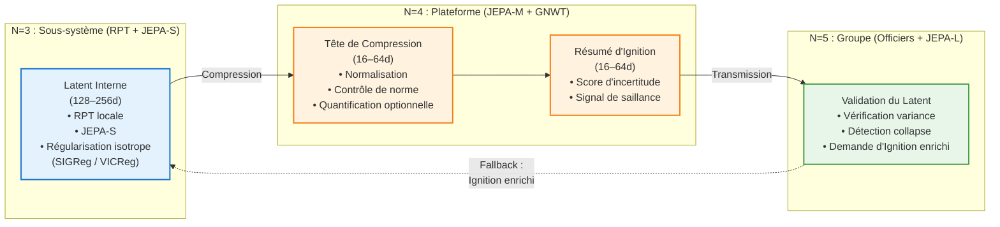
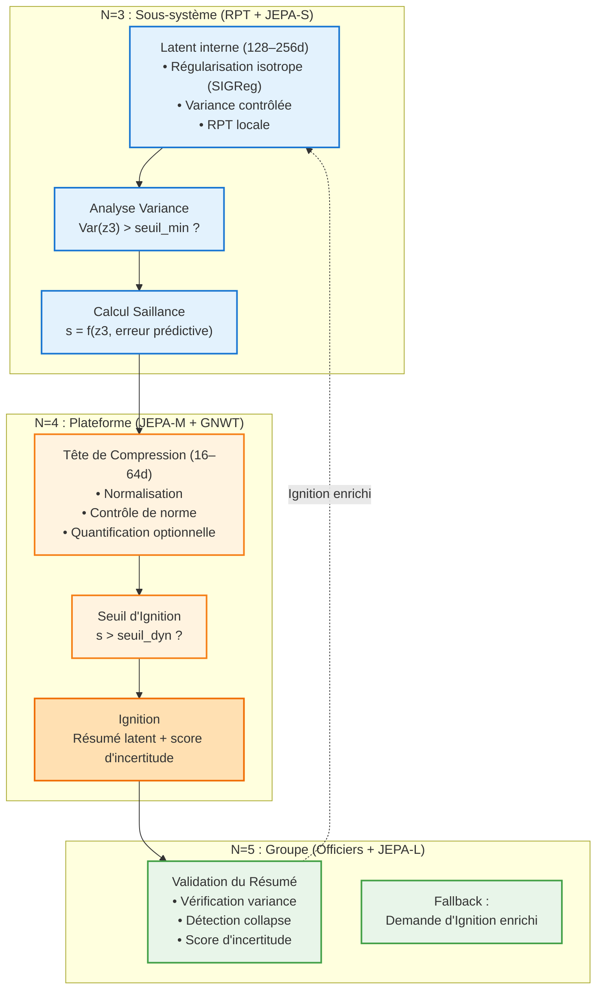

## Architecture Cible Générale : Exemple du GAN 2040

**Principe fondamental :** Chaque frontière verticale est une **Couverture de Markov**. N+1 est aveugle aux états internes de N. Le broadcast GNWT est *intra-niveau* ; la communication *inter-niveau* est uniquement via les résumés d'ignition compressés.

Cette pile décrit l'infrastructure cognitive du Groupe Aéronaval (GAN) en **2040**. Les informations transitent de bas en haut sous forme de **Résumés d'Ignition Compressés** (vecteurs latents abstraits, pas de données brutes), et de haut en bas sous forme de **Prédictions (top-down)** et pas de simples **Priors Contextuels** (contraintes sur les espaces de représentation des niveaux inférieurs).
Les flux descendants ne sont plus de simples contraintes : ce sont des **prédictions actives** générées par le JEPA du niveau supérieur. Le niveau inférieur compare sa réalité à cette prédiction ; si l’écart (surprise) dépasse un seuil adaptatif (fonction du budget attentionnel et de la confiance du Self‑Model), une ignition GNWT est déclenchée. En dessous du seuil, l’écart est résorbé par une mise à jour locale des latents (RPT). Ce mécanisme réalise une inférence active hiérarchique, fondement de la conscience d’accès fonctionnelle.

Chaque niveau conscient intègre également un Self-Model (métacognition), un Attention Scheduler (budget attentionnel) et, en phase de sommeil, un Φ-estimator (intégration causale) – voir dans les sections [Concepts Clés et Fondements Théoriques](../concepts/concepts.md).

### Conscience par niveau : ce qu'on peut attendre

| Niveau | Vie intérieure (RPT) | Conscience d'accès (GNWT) | Peut "rapporter" |
|---|---|---|---|
| N=0-1 | Non | Non | Non |
| N=2 | Minimale (état caché SSM) | Non | Non |
| N=3 | Oui (boucles feedback locales) | Non | Vers N=4 uniquement |
| N=4-5 | Oui, riche | Oui (ignition + broadcast) | Oui, à son niveau |
| N=6 | Oui, narratif | Oui, stratégique | Oui, dialogue humain |

---

### Les Officiers de la Passerelle (N=5) : organisation sociale-cognitive

Le niveau N=5 n'est pas un module monolithique mais une **équipe d'instances spécialisées** partageant un workspace commun (le workspace du groupe) via des résumés d'ignition, sans partager leurs espaces latents internes.

Chaque niveau conscient (N≥4) inclut un Self-Model (MLP) qui génère un méta-vecteur pour chaque ignition, assurant la métacognition et l’explicabilité.

Chaque niveau N≥4 est équipé d’un Attention Scheduler qui alloue un budget attentionnel global. Les ignitions consomment des tokens ; à budget insuffisant, elles sont différées ou inhibées. Le scheduler ajuste dynamiquement le seuil de saillance pour garantir la réactivité en environnement saturé.

Pendant la phase de sommeil, un estimateur Φ̂ (proxy de l’intégration causale) est calculé périodiquement à partir des résumés d’ignition stockés. Une chute de Φ̂ indique un risque de désintégration fonctionnelle et déclenche des mécanismes correctifs (recalibration, rêverie enrichie).

**Règle de communication :** Un officier ne transmet au workspace commun que ce qui a franchi son seuil d'ignition personnel. Comme une équipe de vieux professionnels qui se connaissent, s'estiment, et savent se tenir — ils ne parlent pas à chaque micro-événement, ils parlent quand ça compte.

**Score d'incertitude épistémique :** Chaque résumé d'ignition porte un score de confiance. Un officier qui opère hors de son domaine de compétence pénalise automatiquement son score de saillance. Le capitaine intègre ce signal dans l'arbitrage — pas pour ignorer, mais pour pondérer.

---

### Scénario de Panne en Combat :

**1. N=0/N=1 :** Un éclat de missile endommage la tuyère droite. Le PID augmenté par MLP nano modifie instantanément les angles d'injection en **4 millisecondes** pour éviter l'extinction du moteur. Aucun signal ne remonte — c'est géré localement, en dessous du seuil RPT.

**2. N=2/N=3 :** Le modèle Mamba du moteur enregistre une anomalie croissante. Ses boucles RPT locales tournent, tentent de consolider une évaluation. Après stabilisation, elles génèrent un **Résumé d'Ignition vectoriel** : *[anomalie_propulsion | sévérité=0.73 | type=asymétrie_poussée | workaround_disponible=true]*. Pas de dump de données brutes — un vecteur sémantique compressé.

**3. N=4 – Comparaison prédiction/réalité** :  
Le Rafale reçoit du niveau supérieur (N=5) une **prédiction** de son état attendu (ex. `[état_nominal, poussée=1.0]`). Parallèlement, ses boucles RPT locales produisent une **ignition réelle** `[dégradé, asymétrie=0.73]`. Le comparateur calcule l’erreur (0,73). Comme cette erreur dépasse le seuil dynamique (ex. 0,5), une **ignition GNWT** est déclenchée. Si l’erreur avait été inférieure au seuil, l’écart aurait été résorbé localement (mise à jour du latent RPT) sans broadcast.

**4. N=5/N=6 :** L'officier TACTIQUE du groupe capte l'ignition de Leader-3 en premier (c'est dans son domaine de saillance). Il propose une reconfiguration du schéma de brouillage des frégates. Le CAPITAINE arbite et broadcast la décision au groupe. Le LLM N=6 traduit pour l'amiral : *"Leader-3 maintient sa mission avec une capacité d'évasion réduite de 20%. Réorganisation du schéma de brouillage des frégates pour le couvrir. Durée de la fenêtre de mission réduite à T+15min."* (la prédiction de N=5 est mise à jour via apprentissage)

## 🔧 Contraintes Latentes Structurelles (Anti-Collapse)

Les niveaux N=2 à N=5 échangent des **vecteurs latents compressés** (RPT interne, JEPA prédictif, Résumés d’Ignition). Pour garantir la stabilité de ces flux dans une architecture hiérarchique, trois contraintes structurelles sont imposées :

### 1. Latents internes régularisés (RPT / JEPA)

Chaque module maintient un espace latent **borné mais non dégénéré**.  
Sans contrainte, les modèles prédictifs (JEPA, SSMs) convergent vers un **representation collapse** : tous les inputs mappés vers un même vecteur.

Pour éviter cela, les latents internes sont régularisés via :

- **Isotropie gaussienne** (LeJEPA, SIGReg)  
- **Décorrélation** (VICReg / Barlow Twins)  
- **Normalisation stricte** (LayerNorm)  
- **Bruit gaussien léger** pour éviter les dimensions mortes

Ces mécanismes garantissent que chaque dimension porte une information utile et que les prédictions restent stables dans le temps.

---

### 2. Hiérarchie des tailles : interne > ignition

Pour éviter la perte d’information en cascade :

- latent interne RPT/JEPA : **128–256 dimensions**  
- résumé d’Ignition : **16–64 dimensions**

Le résumé d’Ignition est produit par une **tête de compression dédiée**, qui applique :

- normalisation  
- quantification optionnelle  
- contrôle de norme (||z|| ≈ constant)

Cela garantit une API statistique stable entre niveaux, même en conditions dégradées.

---

### 3. Prévention du “double collapse” multi-niveaux

Dans une architecture N=3→N=4→N=5, deux compressions successives peuvent entraîner un **double collapse** :

- collapse interne du JEPA/RPT  
- collapse du résumé d’Ignition

Pour éviter cela :

- chaque niveau vérifie la **variance par dimension** du latent reçu  
- un résumé d’Ignition trop pauvre déclenche un **signal d’incertitude**  
- le niveau supérieur peut demander un **Ignition enrichi** (fallback)

Ce mécanisme maintient la cohérence des flux latents à travers les couvertures de Markov.

---

### 4. Règles pratiques d’implémentation

- **Toujours régulariser les latents internes** (SIGReg ou équivalent)  
- **Toujours compresser via une tête dédiée** (pas de projection brute)  
- **Monitorer la “vie” du latent** (variance, corrélation, norme)  
- **Tester la valeur du latent** (prédiction de variables observables simples)  
- **Limiter la profondeur de compression** (éviter N=3→N=4→N=5→N=6 sans contrôle)

Ces contraintes assurent la stabilité de l’architecture GAN 2040 dans les scénarios de panne, de combat et de coopération distribuée.

