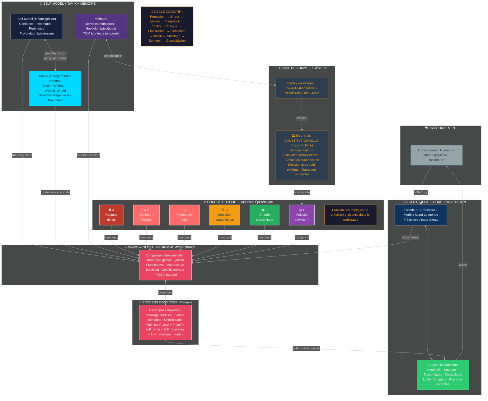

```mermaid
%%{init: {'theme': 'dark', 'themeVariables': { 'primaryColor': '#e94560', 'primaryTextColor': '#ecf0f1', 'primaryBorderColor': '#ffffff', 'lineColor': '#bdc3c7', 'secondaryColor': '#0f3460', 'tertiaryColor': '#533483'}}}%%

graph TB
    subgraph L0["🌍 ENVIRONNEMENT"]
        ENV["Autres agents · Humains · Monde physique · Incertitude"]
    end

    subgraph L1["🔧 AGENTS JEPA — CORE + ADAPTATION"]
        JEPA["Encodeur · Prédicteur · Modèle latent du monde<br/>Prédiction d'états latents"]
        ADAPT["Couche d'adaptation<br/>Perceptifs · Moteurs · Dynamiques · Contextuels<br/>LoRA · Adapters · Plasticité contrôlée"]
        JEPA <--> ADAPT
    end

    subgraph L2["🧠 SELF-MODEL + ToM-X + MÉMOIRE"]
        SELF["Self-Model (Métacognition)<br/>Confiance · Incertitude · Pertinence<br/>Profondeur épistémique"]
        TOM["ToM-X (Theory of Mind étendue)<br/>s^self · s^other · s^other_of_me<br/>Détection d'agentivité · Récursion"]
        MEM["Mémoire<br/>MeMo (sémantique) · Hopfield (épisodique)<br/>TCM (contexte temporel)"]
        SELF <-->|modèle de soi<br/>perçu par autrui| TOM
    end

    subgraph L3["⚖️ COUCHE ÉTHIQUE — Modestie Épistémique"]
        MA["🛡️ A<br/>Respect<br/>de vie"]
        MB["⚔️ B<br/>Honneur /<br/>Fidélité"]
        MC["🔋 C<br/>Préservation<br/>utile"]
        MD["🔍 D<br/>Détecteur<br/>surconfiance"]
        ME["🕊️ E<br/>Charité<br/>épistémique"]
        MF["😰 F<br/>Frilosité<br/>(révision)"]
        ETHIC_NOTE["Publient des masques de précision γ_deontic dans le workspace"]
    end

    subgraph L4["🔥 GNWT — GLOBAL NEURONAL WORKSPACE"]
        GNWT["Compétition attentionnelle · Broadcast global · Ignition<br/>États latents · Masques de précision · Conflits moraux · ToM-X partagé"]
    end

    subgraph L5["🎯 PROCESS COMPOSER (Planner)"]
        PLAN["Décompose objectifs · Interroge modules · Simule scénarios · Choisit action<br/>Minimise F_total = F_self + α·F_other + β·F_recursion + Σ w_i·masque_moral_i"]
    end

    subgraph L6["🌙 PHASE DE SOMMEIL / RÊVERIE"]
        SLEEP["Replay épisodique · Consolidation MeMo · Recalibration core JEPA"]
        REV["🏛️ RÉVISION CONSTITUTIONNELLE (mesure ultime)<br/>Documentation · Simulation rétrospective · Évaluation surconfiance<br/>Décision avec coût extrême · Marquage provisoire"]
    end

    %% Flux principaux
    ENV -->|bottom-up| JEPA
    ADAPT -->|action| ENV

    JEPA -->|états latents| GNWT
    SELF -->|métacognition| GNWT
    TOM -->|modélisation sociale| GNWT
    MEM -->|rappel associatif| GNWT

    MA -->|masque γ| GNWT
    MB -->|masque γ| GNWT
    MC -->|masque γ| GNWT
    MD -->|masque γ| GNWT
    ME -->|masque γ| GNWT
    MF -->|masque γ| GNWT

    GNWT <-->|broadcast| PLAN
    PLAN -->|action sélectionnée| ADAPT

    MEM <-->|consolidation| SLEEP
    SLEEP -->|révision| REV
    REV -.->|si acceptée| MF

    %% Cycle cognitif
    CYCLE["🔄 CYCLE COGNITIF : Perception → Erreur → Ignition → Intégration → ToM-X → Éthique → Planification → Simulation → Action → Stockage → Sommeil → Consolidation"]

    style ENV fill:#95a5a6,stroke:#2c3e50,color:#2c3e50
    style JEPA fill:#0f3460,stroke:#ffffff,color:#ecf0f1
    style ADAPT fill:#2ecc71,stroke:#ffffff,color:#ecf0f1
    style SELF fill:#16213e,stroke:#ffffff,color:#ecf0f1
    style TOM fill:#00d9ff,stroke:#003344,color:#003344
    style MEM fill:#533483,stroke:#ffffff,color:#ecf0f1
    style MA fill:#c0392b,stroke:#ffffff,color:#ecf0f1
    style MB fill:#ff6b6b,stroke:#ffffff,color:#ecf0f1
    style MC fill:#ff6b6b,stroke:#ffffff,color:#ecf0f1
    style MD fill:#f39c12,stroke:#ffffff,color:#2c3e50
    style ME fill:#27ae60,stroke:#ffffff,color:#ecf0f1
    style MF fill:#8e44ad,stroke:#ffffff,color:#ecf0f1
    style GNWT fill:#e94560,stroke:#ffffff,color:#ecf0f1
    style PLAN fill:#e94560,stroke:#ffffff,color:#ecf0f1
    style SLEEP fill:#2c3e50,stroke:#f39c12,color:#f39c12
    style REV fill:#2c3e50,stroke:#f39c12,color:#f39c12
    style CYCLE fill:#1a1a2e,stroke:#f39c12,color:#f39c12
    style ETHIC_NOTE fill:#1a1a2e,stroke:#f39c12,color:#f39c12
```
