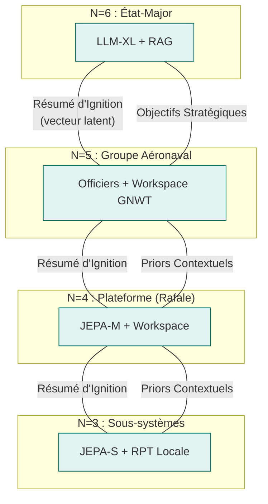
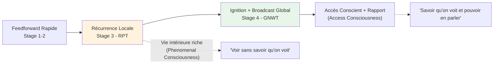
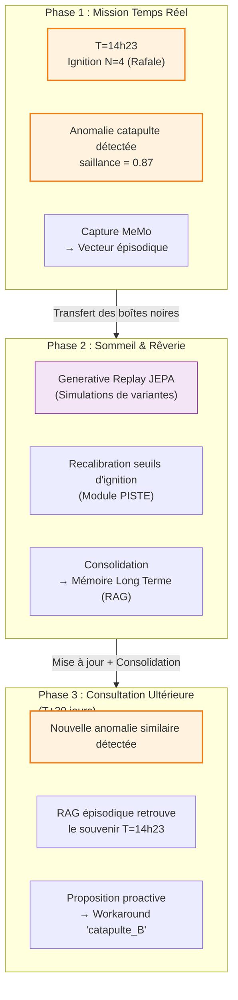

## Concepts Clés et Fondements Théoriques

Pour prouver la viabilité de cette architecture auprès de nos pairs, chaque décision d'ingénierie logicielle s'appuie sur des jalons majeurs de la littérature scientifique en neurosciences, IA et physique théorique.

### A. L'Indépendance Conditionnelle : Les Couvertures de Markov Imbriquées

**Fondement Théorique :**
[Judea Pearl, *Probabilistic Reasoning in Intelligent Systems*, 1988](https://www.sciencedirect.com/book/monograph/9780080514895/probabilistic-reasoning-in-intelligent-systems) pour les réseaux bayésiens ;
[Kirchhoff, Parr, Palacios, Friston, Kiverstein, *The Markov blankets of life: autonomy, active inference and the free energy principle* (2018)](https://royalsocietypublishing.org/doi/10.1098/rsif.2017.0792) pour la biologie théorique ;
[Ciaunica, Levin, Rosas, Friston et al., *Nested Selves: Self-Organization and Shared Markov Blankets in Prenatal Development in Humans* (2023)](https://onlinelibrary.wiley.com/doi/10.1111/tops.12717) pour la généralisation aux systèmes collectifs.

**Le Concept :** La couverture de Markov désigne la membrane statistique séparant les états internes ($I$) d'un système des états externes ($E$) de son environnement. Elle est composée d'états sensoriels (entrées) et actifs (sorties). L'équation fondamentale d'indépendance s'écrit :

$$P(I \mid B, E) = P(I \mid B)$$

**Ce que la littérature récente ajoute :** Un collectif d'agents d'inférence active peut, s'il maintient une couverture de Markov au niveau du groupe, constituer un agent de niveau supérieur avec son propre modèle génératif. Cette propriété est *scale-free* : elle s'applique de la cellule à l'organisme, et de l'effecteur au groupe aéronaval. Les structures s'emboîtent comme des poupées russes.

**Justification Technique :** C'est le principe d'**anti-fusion d'identité**. Le niveau supérieur ($N+1$) ne traite jamais les données brutes de $N$ — seulement son API statistique (le *résumé d'ignition*). Ceci garantit la modularité stricte du composant jusqu'à la flotte complète, et préserve l'identité de chaque niveau comme entité cognitive propre. Un Rafale conscient est perçu par le groupe comme un objet externe opaque — exactement comme vous percevez votre foie comme "allant bien" sans accéder aux hépatocytes.



---

### B. La Conscience à Deux Étages : GNWT + RPT comme facettes d'un même mécanisme

**Fondement Théorique :** [Bernard Baars, *A Cognitive Theory of Consciousness*, 1988](https://philpapers.org/rec/BAAACT) et [Stanislas Dehaene (*A Neuronal Model of a Global Workspace in Effortful Cognitive Tasks*, 2006)](https://nyaspubs.onlinelibrary.wiley.com/doi/abs/10.1111/j.1749-6632.2001.tb05714.x) pour la *Global Neuronal Workspace Theory* (GNWT) ; [Victor Lamme, *Towards a true neural stance on consciousness*, 2006](https://www.cell.com/trends/cognitive-sciences/abstract/S1364-6613(06)00237-3) ; travaux d'intégration du [consortium COGITATE](https://www.arc-cogitate.com/project) et surtout [Storm et al., *An integrative, multiscale view on neural theories of consciousness*, Neuron, 2024](https://www.sciencedirect.com/science/article/pii/S0896627324000886).

**Le Concept :** Longtemps présentées comme concurrentes, GNWT et RPT décrivent en réalité **deux phases temporelles et fonctionnelles complémentaires** d’un même processus de traitement conscient, comme le soulignent Storm et al. dans leur synthèse multiscale :



La **RPT** rend compte de la **vie intérieure riche** de chaque module grâce aux boucles de rétroaction locales (recurrent processing). Elle explique la phenomenal consciousness (PC) — l’expérience subjective brute, même non rapportable. La **GNWT** décrit ce qui se passe quand un signal consolidé franchit un seuil de saillance et se propage largement dans le workspace global, permettant l’**access consciousness** (AC) : intégration, rapport, arbitrage et contrôle volontaire.

**Conséquence architecturale critique :** Dans notre hiérarchie, le seuil RPT→GNWT se situe naturellement à la frontière **N=3 → N=4**. En-dessous : traitement continu en RPT locale (vie intérieure des sous-systèmes, sans broadcast global). À partir de N=4 : workspace central, ignitions, et capacité de « rapporter » un résumé compressé vers le niveau supérieur.

Cette séparation n’est pas arbitraire — elle reflète à la fois les contraintes computationnelles (coût du broadcast) et les mécanismes biologiques identifiés par la littérature récente. Comme le note Storm et al., les théories ne s’opposent pas mais opèrent à des échelles complémentaires : locale (RPT) et globale (GNWT).

**Justification Technique :** Un réacteur d’avion (N=2-3) résout ses micro-pannes en boucles RPT locales (Mamba). Si le dommage dépasse sa capacité, il génère un **Résumé d’Ignition** vectoriel vers le haut. Le Rafale (N=4) capte ce signal dans son workspace GNWT, reconfigure sa loi de vol, et ne remonte qu’un résumé abstrait au groupe — préservant ainsi les couvertures de Markov tout en permettant une conscience d’accès fonctionnelle à chaque niveau pertinent.

---

### C. La Prédiction Abstraite : Les Modèles du Monde Latents (JEPA)

**Fondement Théorique :**
[Yann LeCun, *A Path Towards Autonomous Machine Intelligence* (2022)](https://www.semanticscholar.org/paper/A-Path-Towards-Autonomous-Machine-Intelligence-LeCun-Courant/775f42ed458b8c5b0f2094ea4ff5b64c557b1a34) ;
[Hafner et al., *Mastering Atari with Discrete World Models* (2021)](https://arxiv.org/abs/2010.02193).

**Le Concept :** Contrairement aux modèles génératifs pixel par pixel, la *Joint Embedding Predictive Architecture* (JEPA) apprend à prédire des **représentations abstraites** (vecteurs latents) du monde en ignorant le bruit inutile. Sa nature prédictive *always-on* permet un monitoring sémantique continu — le modèle maintient un flux sémantique permanent qui n'est "verbalisé" que lors d'une ignition.

**Pourquoi JEPA plutôt qu'un LLM pour le workspace global :** Un LLM est passif, réactif, dépendant du token. Il n'a pas de cycle temporel propre. JEPA opère dans un espace latent compact, prédit dans l'espace des représentations (pas dans l'espace pixel/token), peut tourner en continu, et s'auto-supervise — il apprend donc en continu sans annotations. C'est structurellement plus proche d'un thalamus que d'un cortex préfrontal verbal. **Le LLM est l'interface de sortie, pas le workspace.**

**Justification Technique :** C'est le moteur de la **rêverie artificielle** (*Generative Replay*). Le système simule des millions de trajectoires tactiques ou de configurations de pannes directement dans son imagination latente pendant ses phases de repos, éliminant l'usure mécanique et le risque de crash en apprentissage réel.

---

### D. Les Architectures Légères pour le Temps Réel : SSMs (Mamba, RWKV, xLSTM)

**Fondement Théorique :**
[Gu & Dao, *Mamba: Linear-Time Sequence Modeling with Selective State Spaces* (2023)](https://arxiv.org/abs/2312.00752) ;
[Peng et al., *RWKV: Reinventing RNNs for the Transformer Era* (2023)](https://arxiv.org/abs/2305.13048) ;
[Beck et al., *xLSTM: Extended Long Short-Term Memory* (2024)](https://arxiv.org/abs/2405.04517).

**Le Concept :** Les *State Space Models* (SSMs) offrent une alternative aux Transformers pour les couches basses (N=0 à N=3), avec des propriétés cruciales pour l'embarqué :

| Architecture | Avantage clé | Usage cible dans le SoS |
|---|---|---|
| **MLP nano + PID** | µs, déterministe, FPGA | N=0 : boucle de contrôle physique |
| **Mamba-mini** | linéaire en séquence, faible RAM | N=1 : actionneurs intelligents |
| **Mamba / RWKV** | 5× throughput vs Transformer, continu | N=2-3 : sous-systèmes, perception |
| **JEPA-S** | prédiction latente, RPT local | N=3 : début de vie intérieure |
| **JEPA-M/L + GNWT** | workspace, ignition, broadcast | N=4-5 : conscience de plateforme |
| **JEPA-XL + LLM** | narratif, stratégique, multimodal | N=5-6 : commandement, dialogue amiral |

**Justification Technique :** Mamba démontre des signaux de contrôle plus lisses et physiquement plausibles que les Transformers (qui peuvent produire des discontinuités dans les signaux de contrôle). Pour les couches N=1 à N=3, c'est exactement ce qu'il faut : un traitement fluide, continu, réactif, sans le coût quadratique de l'attention.

---

### E. La Psychopathologie Computationnelle et Profils Fonctionnels

**Fondement Théorique :**
[Friston, *Computational psychiatry: from synapses to sentience* (2022)](https://www.nature.com/articles/s41380-022-01743-z) ;
[Teufel & Fletcher, *The promises and pitfalls of applying computational models to neurological and psychiatric disorders* (2016)](https://academic.oup.com/brain/article/139/10/2600/2196698) ; 
[Karl Friston, *Computational psychiatry: from synapses to sentience*](https://www.nature.com/articles/s41380-022-01743-z)
[Nettle, *Personality: What makes you the way you are* (2023)](https://www.researchgate.net/publication/375324828_Personality_What_Makes_You_The_Way_You_Are) pour le modèle Big Five évolutif ;
[Baron-Cohen, *Autism: the empathizing-systemizing (E-S) theory* (2009)](https://pubmed.ncbi.nlm.nih.gov/19338503/) ;
[Bakiaj, Pantoja Muñoz, Bizzego, Grecucci, *Unmasking the Dark Triad: A Data Fusion Machine Learning Approach to Characterize the Neural Bases of Narcissistic, Machiavellian and Psychopathic Traits* (2025)](https://onlinelibrary.wiley.com/doi/10.1111/ejn.16674).

**Le Concept :** Les traits de personnalité sont modélisés comme des **ajustements d'hyperparamètres** dans le traitement des probabilités d'erreur. Ce ne sont pas des "modes" qu'on active, mais des biais structurels dans les fonctions de saillance et les seuils d'ignition.

**Profils d'officiers et leur base neuroscientifique :**

| Rôle | Trait dominant | Mécanisme | Domaine d'ignition privilégié |
|---|---|---|---|
| **Science / Analyse** | Ouverture + TSA-Systemizing | Connectivité locale forte, faible longue portée | Anomalies, incohérences logiques, signaux faibles |
| **Soin / Équipage** | Agréabilité haute, insula/ACC actif | Ocytocine, circuits d'empathie | États internes humains, éthique, cohésion |
| **Ingénieur** | Conscienciosité très haute | PFC fort, contrôle inhibiteur, faible impulsivité | Pannes, dérives systèmes, qualité d'exécution |
| **Tactique** | Persévérant + Dark Triad modéré | Mémoire des échecs, faible traitement peur | Menaces, vulnérabilités, fenêtres d'action |
| **Renseignement** | Ouverture + faible agréabilité | Dopamine exploratoire, détection d'incohérence | Patterns adverses, déception, asymétrie d'information |
| **Capitaine** | Extraversion + Névrosisme situationnel | DA reward, flexibilité PFC, arbitrage | Crises, opportunités, narrative globale de mission |

**Anti-fusion par profil :** Les espaces latents de chaque officier sont **non partagés**. Ils échangent uniquement des *résumés d'ignition* via le canal de commandement. La mémoire épisodique propre à chaque officier est son identité — c'est ce qui est préservé, comme chez les jumeaux craniopages qui maintiennent des volontés distinctes malgré des circuits partiellement partagés.

**Justification Technique :** L'autisme computationnel (surpondération de la précision sensorielle face aux attentes contextuelles) est injecté dans les couches radar basses (N=3) pour isoler les signaux faibles sans biais contextuel. Les traits Dark Triad fonctionnels : le Machiavélisme dans les algorithmes de déception cyber (théorie des jeux), la Psychopathie fonctionnelle dans la vitesse d'exécution des effecteurs de tir (N=4) — froide, non-empathique, mais contrainte constitutionnellement.

---

### F. L'Exploration par la Curiosité et l'Apprentissage par le Jeu

**Fondement Théorique :**
[Jürgen Schmidhuber, *Formal Theory of Creativity, Fun, and Intrinsic Motivation*, 1990-2010](https://www.researchgate.net/publication/224155374_Formal_Theory_of_Creativity_Fun_and_Intrinsic_Motivation_1990-2010) ;
[Oudeyer & Kaplan, *What is Intrinsic Motivation? A Typology of Computational Approaches* (2007)](https://doi.org/10.3389/neuro.12.006.2007) ;
[Oudeyer, *Intrinsic Motivation Systems for Autonomous Learning*, 2007](https://web-archive.southampton.ac.uk/cogprints.org/5473/index.html).

**Le Concept :** La curiosité est une **fonction de récompense intrinsèque** basée sur le gain d'information (réduction de l'entropie prédictive). L'agent est récompensé quand il explore des zones où son modèle du monde est encore imprécis — ni trop simples (ennuyeuses), ni trop chaotiques (incompréhensibles). La zone d'apprentissage optimale est celle où le *progrès d'apprentissage* est maximal.

**Le jeu comme protocole d'entraînement :** Les phases hors-opération sont structurées comme des *wargames* à règles variables. Le système joue contre lui-même (variante MCTS dans l'espace latent JEPA), contre des adversaires simulés paramétriques, et contre des versions passées de lui-même. Chaque session de jeu génère des *vecteurs de surprise* qui alimentent la phase de Rêverie (voir Cycle d'Apprentissage, §3.C).

**Justification Technique :** Cela évite le blocage des systèmes face aux situations *Out of Distribution*. Un système entraîné uniquement sur des données de mission réelles sera brittlé face aux situations non vécues. Le jeu génère de la diversité d'expériences à coût bas.

---


### G. La Mémoire Épisodique Continue (MeMo / Continuous Online Training)

**Fondement Théorique :**  
[Quek et al., *MeMo: Memory as a Model* (2026)](https://arxiv.org/abs/2605.15156) ; [Kirkpatrick et al., *Overcoming Catastrophic Forgetting* (2017)](https://arxiv.org/abs/1612.00796) ; [Walker, *The Role of Sleep in Cognition and Emotion* (2017)](https://pubmed.ncbi.nlm.nih.gov/19338508/).

**Le Concept :** La mémoire épisodique n’est pas un simple journal de logs, mais un **flux continu de vecteurs latents compressés** qui capture uniquement les moments de forte saillance (ignitions). Chaque événement significatif devient un **souvenir épisodique** riche : état latent JEPA + métadonnées contextuelles.

**Exemple concret : Anomalie Catapulte**



**Détail du vecteur épisodique stocké :**
```yaml
Ignition_ID: 2026-05-24_1423_Leader3
Module: PISTE_N4
Saillance: 0.87
État latent JEPA: [0.42, -0.17, 0.91, ..., 0.63]
Tags: [anomalie_catapulte, asymétrie_poussée, dégradé]
Outcome: mission_abort=false
Workaround: catapulte_B
Contexte: vent_25kt, pont_mouillé, leader_formation
```

**Justification Technique :** C’est la différence fondamentale entre un système qui *performe* et un système qui **apprend vraiment** de son expérience. La mémoire épisodique MeMo devient également le support de l’**identité durable** de chaque module ou officier — sa biographie personnelle d’ignitions constitue son "moi" computationnel, préservé même après des mises à jour des poids.

**Mécanisme MeMo :**
- **Mission** : Capture en streaming des ignitions (N=3 → N=6)
- **Rêverie** : Generative Replay dans l’espace latent JEPA
- **Débriefing** : Consolidation et sédimentation dans la mémoire long terme (RAG épisodique)

Ce mécanisme permet à la fois l’apprentissage continu sans *catastrophic forgetting* et la préservation d’une identité propre à chaque entité du SoS.
