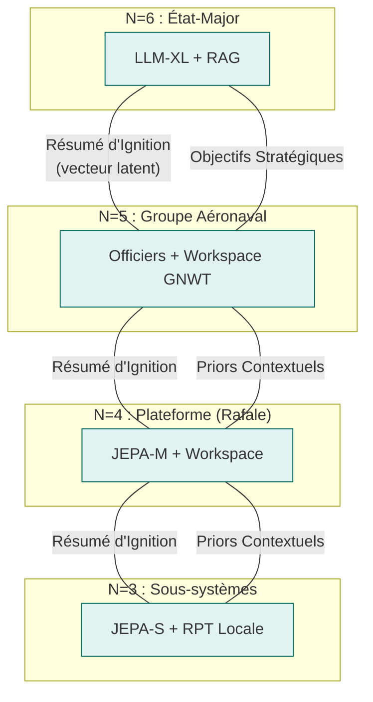
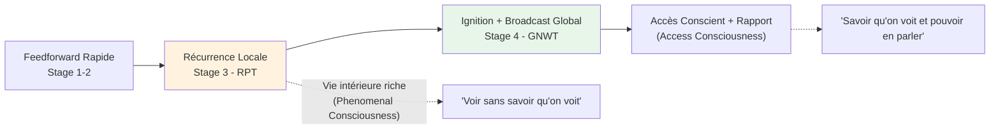
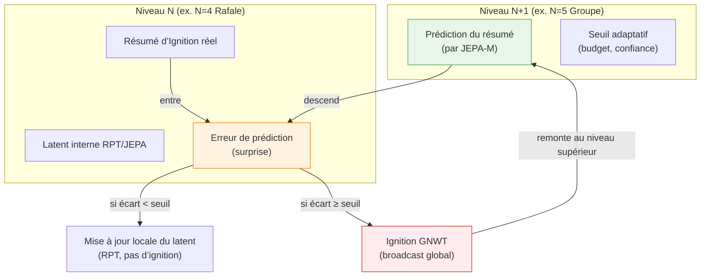
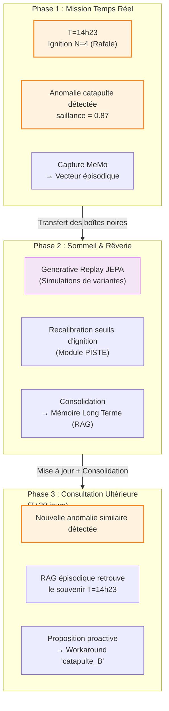
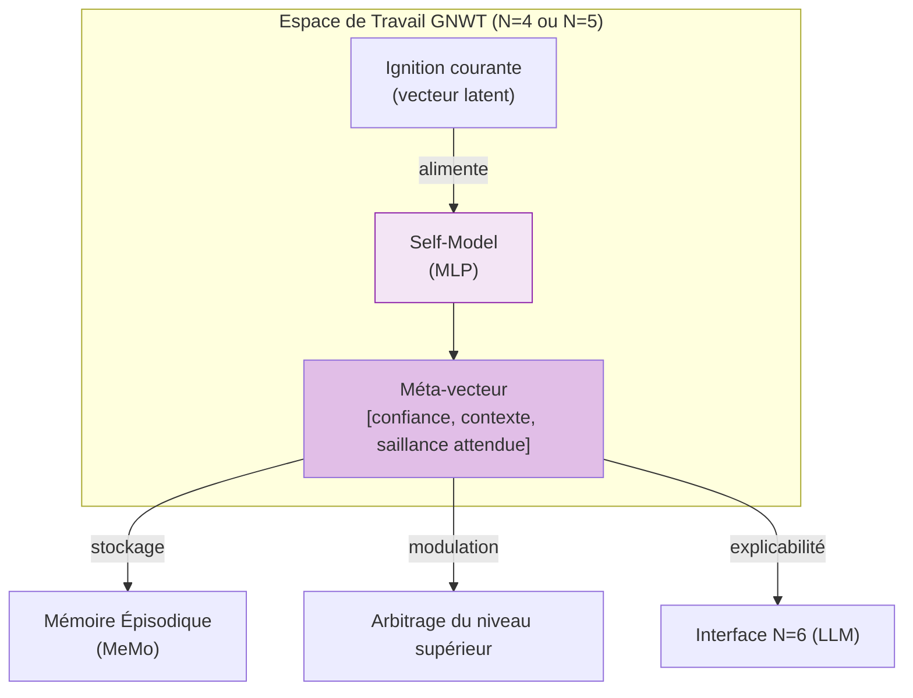
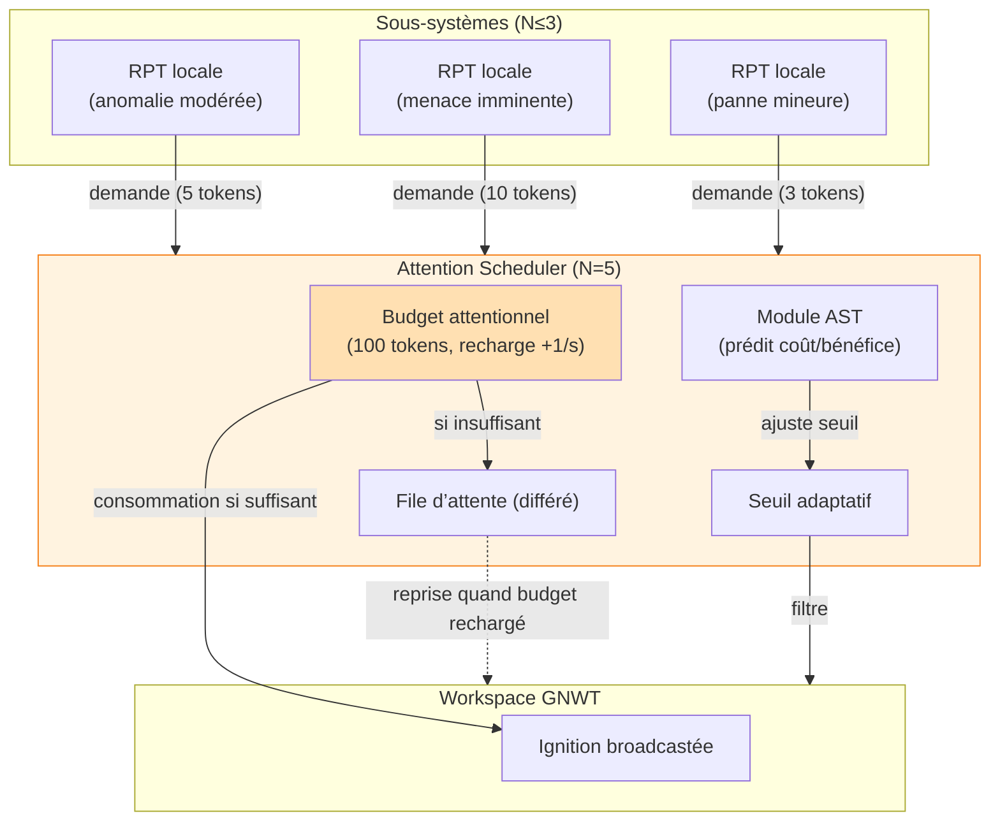
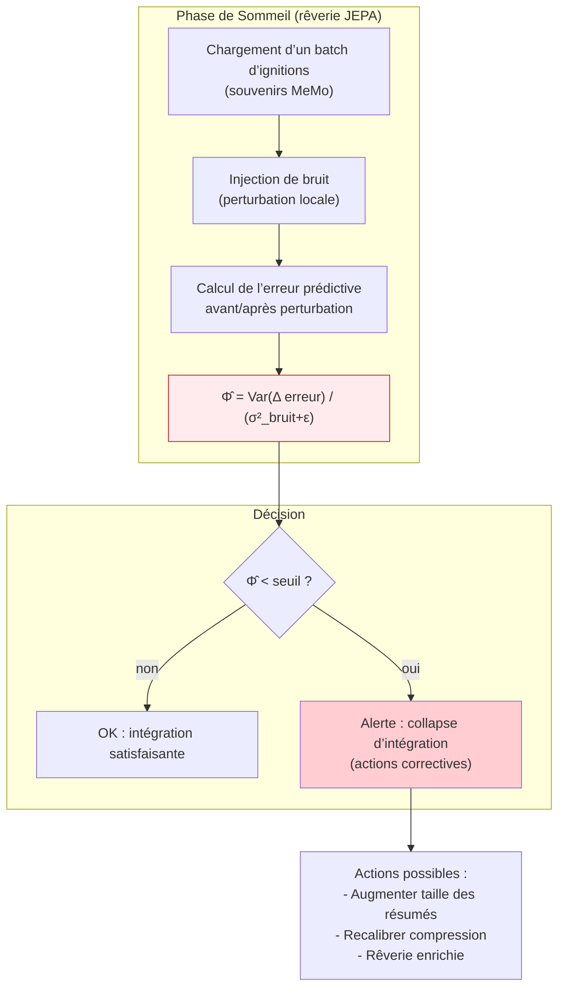

## Concepts Clés et Fondements Théoriques

Pour prouver la viabilité de cette architecture auprès de nos pairs, chaque décision d'ingénierie logicielle s'appuie sur des jalons majeurs de la littérature scientifique en neurosciences, IA et physique théorique.

### A. L'Indépendance Conditionnelle : Les Couvertures de Markov Imbriquées

**Fondement Théorique :**
[Judea Pearl, *Probabilistic Reasoning in Intelligent Systems*, 1988](https://www.sciencedirect.com/book/monograph/9780080514895/probabilistic-reasoning-in-intelligent-systems) pour les réseaux bayésiens ;
[Kirchhoff, Parr, Palacios, Friston, Kiverstein, *The Markov blankets of life: autonomy, active inference and the free energy principle* (2018)](https://royalsocietypublishing.org/doi/10.1098/rsif.2017.0792) pour la biologie théorique ;
[Ciaunica, Levin, Rosas, Friston et al., *Nested Selves: Self-Organization and Shared Markov Blankets in Prenatal Development in Humans* (2023)](https://onlinelibrary.wiley.com/doi/10.1111/tops.12717) pour la généralisation aux systèmes collectifs.

**Le Concept :** La couverture de Markov désigne la membrane statistique séparant les états internes ($I$) d'un système des états externes ($E$) de son environnement. Elle est composée d'états sensoriels (entrées) et actifs (sorties). L'équation fondamentale d'indépendance s'écrit :

$$P(I \mid B, E) = P(I \mid B)$$

**Ce que la littérature récente ajoute :** Un collectif d'agents d'inférence active peut, s'il maintient une couverture de Markov au niveau du groupe, constituer un agent de niveau supérieur avec son propre modèle génératif. Cette propriété est *scale-free* : elle s'applique de la cellule à l'organisme, et de l'effecteur au groupe aéronaval. Les structures s'emboîtent comme des poupées russes.

**Justification Technique :** C'est le principe d'**anti-fusion d'identité**. Le niveau supérieur ($N+1$) ne traite jamais les données brutes de $N$ — seulement son API statistique (le *résumé d'ignition*). Ceci garantit la modularité stricte du composant jusqu'à la flotte complète, et préserve l'identité de chaque niveau comme entité cognitive propre. Un Rafale conscient est perçu par le groupe comme un objet externe opaque — exactement comme vous percevez votre foie comme "allant bien" sans accéder aux hépatocytes.



---

### B. La Conscience à Deux Étages : GNWT + RPT comme facettes d'un même mécanisme

**Fondement Théorique :** [Bernard Baars, *A Cognitive Theory of Consciousness*, 1988](https://philpapers.org/rec/BAAACT) et [Stanislas Dehaene (*A Neuronal Model of a Global Workspace in Effortful Cognitive Tasks*, 2006)](https://nyaspubs.onlinelibrary.wiley.com/doi/abs/10.1111/j.1749-6632.2001.tb05714.x) pour la *Global Neuronal Workspace Theory* (GNWT) ; [Victor Lamme, *Towards a true neural stance on consciousness*, 2006](https://www.cell.com/trends/cognitive-sciences/abstract/S1364-6613(06)00237-3) ; travaux d'intégration du [consortium COGITATE](https://www.arc-cogitate.com/project) et surtout [Storm et al., *An integrative, multiscale view on neural theories of consciousness*, Neuron, 2024](https://www.sciencedirect.com/science/article/pii/S0896627324000886).

**Le Concept :** Longtemps présentées comme concurrentes, GNWT et RPT décrivent en réalité **deux phases temporelles et fonctionnelles complémentaires** d’un même processus de traitement conscient, comme le soulignent Storm et al. dans leur synthèse multiscale :



La **RPT** rend compte de la **vie intérieure riche** de chaque module grâce aux boucles de rétroaction locales (recurrent processing). Elle explique la phenomenal consciousness (PC) — l’expérience subjective brute, même non rapportable. La **GNWT** décrit ce qui se passe quand un signal consolidé franchit un seuil de saillance et se propage largement dans le workspace global, permettant l’**access consciousness** (AC) : intégration, rapport, arbitrage et contrôle volontaire.

**Conséquence architecturale critique :** Dans notre hiérarchie, le seuil RPT→GNWT se situe naturellement à la frontière **N=3 → N=4**. En-dessous : traitement continu en RPT locale (vie intérieure des sous-systèmes, sans broadcast global). À partir de N=4 : workspace central, ignitions, et capacité de « rapporter » un résumé compressé vers le niveau supérieur.

Cette séparation n’est pas arbitraire — elle reflète à la fois les contraintes computationnelles (coût du broadcast) et les mécanismes biologiques identifiés par la littérature récente. Comme le note Storm et al., les théories ne s’opposent pas mais opèrent à des échelles complémentaires : locale (RPT) et globale (GNWT).

**Justification Technique :** Un réacteur d’avion (N=2-3) résout ses micro-pannes en boucles RPT locales (Mamba). Si le dommage dépasse sa capacité, il génère un **Résumé d’Ignition** vectoriel vers le haut. Le Rafale (N=4) capte ce signal dans son workspace GNWT, reconfigure sa loi de vol, et ne remonte qu’un résumé abstrait au groupe — préservant ainsi les couvertures de Markov tout en permettant une conscience d’accès fonctionnelle à chaque niveau pertinent.

---

## C. Modèles du monde et inférence active hiérarchique (JEPA + Predictive Processing)

### Fondement théorique

- **Joint Embedding Predictive Architecture (JEPA)** : LeCun (2022) – prédire des représentations abstraites (latentes) du monde plutôt que les observations brutes. Ignore le bruit inutile et favorise l’apprentissage de structures causales.
- **Predictive Processing (PP)** : Friston, Clark (2013) – le cerveau est une machine à prédire qui minimise en permanence l’erreur de prédiction. La conscience émerge lorsque cette erreur ne peut être résorbée localement.
- **Inférence active** : Friston et al. (2010) – un agent minimise son énergie libre en agissant sur le monde pour rendre ses prédictions vraies.
- **Hiérarchies prédictives** : les niveaux supérieurs génèrent des prédictions (priors) qui contraignent les représentations des niveaux inférieurs ; l’erreur résiduelle remonte.

### Le concept

Votre architecture utilise déjà **JEPA** comme moteur de prédiction latente et des **priors contextuels** descendants. L’inférence active hiérarchique unifie et renforce ces deux flux :

- **Prédictions descendantes (top‑down)** : chaque niveau N+1 génère une **prédiction** du résumé d’ignition que le niveau N devrait produire. Cette prédiction est apprise par le JEPA du niveau supérieur (l’encodeur et le prédicteur).
- **Erreur de prédiction ascendante (bottom‑up)** : le niveau N compare la prédiction reçue avec son ignition réelle (ou son latent interne). L’écart – la **surprise** – est un signal d’erreur qui remonte.
- **Seuil d’ignition GNWT** : l’ignition (broadcast global) ne se produit que lorsque la surprise dépasse un **seuil adaptatif** (dépendant du budget attentionnel, du contexte, de l’historique). En dessous du seuil, l’erreur est résorbée localement par des mises à jour des latents (RPT).
- **Minimisation de l’énergie libre** : l’ensemble du système apprend à réduire la somme des erreurs de prédiction à tous les niveaux, ce qui l’amène à affiner ses modèles du monde (JEPA) et à sélectionner des actions qui rendent le monde plus prévisible.

Dans cette vision, les **priors contextuels** ne sont plus des vecteurs fixes envoyés de manière unidirectionnelle. Ce sont des **prédictions actives** : le niveau supérieur *anticipe* ce que le niveau inférieur devrait voir, et le niveau inférieur *ajuste* ses représentations pour coller à ces prédictions – ou remonte une erreur si l’écart est trop grand.

> **Seuil adaptatif** : défini par `seuil = f(budget_attentionnel, confiance_Self_Model)`.  
> - Budget haut + confiance haute → seuil élevé (peu d’ignitions).  
> - Budget bas + confiance basse → seuil bas (réactivité maximale).  
> Ce seuil est appris pendant la phase de sommeil via la minimisation de l’énergie libre.

### Justification technique

- **Unification théorique** : JEPA devient l’implémentation concrète de la prédiction dans une hiérarchie d’inférence active. On garde les avantages de JEPA (prédiction latente, robustesse au bruit) tout en bénéficiant du formalisme de l’inférence active (énergie libre, causalité descendante permanente).
- **Résout le problème de la causalité descendante** pointé dans la discussion (§3.5) : les prédictions descendantes contraignent en continu les espaces perceptifs, et l’ignition n’intervient que quand la prédiction échoue.
- **Améliore la stabilité et l’apprentissage** : l’erreur de prédiction est un signal dense pour l’apprentissage continu (phase de sommeil). Le système peut « rêver » en générant ses propres prédictions et en minimisant l’erreur sur des trajectoires simulées.
- **Seuil d’ignition adaptatif** : la rareté attentionnelle (budget) et la confiance (self‑model) peuvent moduler le seuil, rendant le système moins bavard en conditions nominales et plus réactif en situation de surprise.

### Schéma




### Exemple concret : anomalie catapulte revisitée

**Situation nominale** : le JEPA-M du Rafale (N=4) prédit que son prochain résumé d’ignition sera `[état_nominal, poussée=1.0]`. Le niveau supérieur (N=5) envoie cette prédiction. Le Rafale compare avec son ignition réelle (idem). L’erreur est quasi nulle → pas d’ignition. Le système fonctionne en mode silencieux, économe en ressources.

**Anomalie** : la tuyère est endommagée. Le Rafale génère une ignition réelle `[dégradé, asymétrie=0.73]`. La prédiction descendante (nominale) produit une erreur importante. Comme l’erreur dépasse le seuil adaptatif (par exemple 0.5), une **ignition GNWT** est déclenchée. Celle-ci remonte au niveau supérieur et met à jour la prédiction pour les cycles futurs (apprentissage).

**Apprentissage** : pendant la phase de sommeil, le système rejoue cette séquence. Le JEPA apprend à prédire l’ignition dégradée à partir du contexte de l’anomalie. La prochaine fois qu’une asymétrie similaire apparaît, la prédiction descendante sera `[dégradé, asymétrie≈0.7]`, l’erreur restera faible, et aucune ignition ne sera nécessaire – sauf si l’anomalie s’aggrave.

---

### D. Les Architectures Légères pour le Temps Réel : SSMs (Mamba, RWKV, xLSTM)

**Fondement Théorique :**
[Gu & Dao, *Mamba: Linear-Time Sequence Modeling with Selective State Spaces* (2023)](https://arxiv.org/abs/2312.00752) ;
[Peng et al., *RWKV: Reinventing RNNs for the Transformer Era* (2023)](https://arxiv.org/abs/2305.13048) ;
[Beck et al., *xLSTM: Extended Long Short-Term Memory* (2024)](https://arxiv.org/abs/2405.04517).

**Le Concept :** Les *State Space Models* (SSMs) offrent une alternative aux Transformers pour les couches basses (N=0 à N=3), avec des propriétés cruciales pour l'embarqué :

| Architecture | Avantage clé | Usage cible dans le SoS |
|---|---|---|
| **MLP nano + PID** | µs, déterministe, FPGA | N=0 : boucle de contrôle physique |
| **Mamba-mini** | linéaire en séquence, faible RAM | N=1 : actionneurs intelligents |
| **Mamba / RWKV** | 5× throughput vs Transformer, continu | N=2-3 : sous-systèmes, perception |
| **JEPA-S** | prédiction latente, RPT local | N=3 : début de vie intérieure |
| **JEPA-M/L + GNWT** | workspace, ignition, broadcast | N=4-5 : conscience de plateforme |
| **JEPA-XL + LLM** | narratif, stratégique, multimodal | N=5-6 : commandement, dialogue amiral |

**Justification Technique :** Mamba démontre des signaux de contrôle plus lisses et physiquement plausibles que les Transformers (qui peuvent produire des discontinuités dans les signaux de contrôle). Pour les couches N=1 à N=3, c'est exactement ce qu'il faut : un traitement fluide, continu, réactif, sans le coût quadratique de l'attention.

---

### E. La Psychopathologie Computationnelle et Profils Fonctionnels

**Fondement Théorique :**
[Friston, *Computational psychiatry: from synapses to sentience* (2022)](https://www.nature.com/articles/s41380-022-01743-z) ;
[Teufel & Fletcher, *The promises and pitfalls of applying computational models to neurological and psychiatric disorders* (2016)](https://academic.oup.com/brain/article/139/10/2600/2196698) ; 
[Karl Friston, *Computational psychiatry: from synapses to sentience*](https://www.nature.com/articles/s41380-022-01743-z)
[Nettle, *Personality: What makes you the way you are* (2023)](https://www.researchgate.net/publication/375324828_Personality_What_Makes_You_The_Way_You_Are) pour le modèle Big Five évolutif ;
[Baron-Cohen, *Autism: the empathizing-systemizing (E-S) theory* (2009)](https://pubmed.ncbi.nlm.nih.gov/19338503/) ;
[Bakiaj, Pantoja Muñoz, Bizzego, Grecucci, *Unmasking the Dark Triad: A Data Fusion Machine Learning Approach to Characterize the Neural Bases of Narcissistic, Machiavellian and Psychopathic Traits* (2025)](https://onlinelibrary.wiley.com/doi/10.1111/ejn.16674).

**Le Concept :** Les traits de personnalité sont modélisés comme des **ajustements d'hyperparamètres** dans le traitement des probabilités d'erreur. Ce ne sont pas des "modes" qu'on active, mais des biais structurels dans les fonctions de saillance et les seuils d'ignition.

**Profils d'officiers et leur base neuroscientifique :**

| Rôle | Trait dominant | Mécanisme | Domaine d'ignition privilégié |
|---|---|---|---|
| **Science / Analyse** | Ouverture + TSA-Systemizing | Connectivité locale forte, faible longue portée | Anomalies, incohérences logiques, signaux faibles |
| **Soin / Équipage** | Agréabilité haute, insula/ACC actif | Ocytocine, circuits d'empathie | États internes humains, éthique, cohésion |
| **Ingénieur** | Conscienciosité très haute | PFC fort, contrôle inhibiteur, faible impulsivité | Pannes, dérives systèmes, qualité d'exécution |
| **Tactique** | Persévérant + Dark Triad modéré | Mémoire des échecs, faible traitement peur | Menaces, vulnérabilités, fenêtres d'action |
| **Renseignement** | Ouverture + faible agréabilité | Dopamine exploratoire, détection d'incohérence | Patterns adverses, déception, asymétrie d'information |
| **Capitaine** | Extraversion + Névrosisme situationnel | DA reward, flexibilité PFC, arbitrage | Crises, opportunités, narrative globale de mission |

**Anti-fusion par profil :** Les espaces latents de chaque officier sont **non partagés**. Ils échangent uniquement des *résumés d'ignition* via le canal de commandement. La mémoire épisodique propre à chaque officier est son identité — c'est ce qui est préservé, comme chez les jumeaux craniopages qui maintiennent des volontés distinctes malgré des circuits partiellement partagés.

**Justification Technique :** L'autisme computationnel (surpondération de la précision sensorielle face aux attentes contextuelles) est injecté dans les couches radar basses (N=3) pour isoler les signaux faibles sans biais contextuel. Les traits Dark Triad fonctionnels : le Machiavélisme dans les algorithmes de déception cyber (théorie des jeux), la Psychopathie fonctionnelle dans la vitesse d'exécution des effecteurs de tir (N=4) — froide, non-empathique, mais contrainte constitutionnellement.

---

### F. L'Exploration par la Curiosité et l'Apprentissage par le Jeu

**Fondement Théorique :**
[Jürgen Schmidhuber, *Formal Theory of Creativity, Fun, and Intrinsic Motivation*, 1990-2010](https://www.researchgate.net/publication/224155374_Formal_Theory_of_Creativity_Fun_and_Intrinsic_Motivation_1990-2010) ;
[Oudeyer & Kaplan, *What is Intrinsic Motivation? A Typology of Computational Approaches* (2007)](https://doi.org/10.3389/neuro.12.006.2007) ;
[Oudeyer, *Intrinsic Motivation Systems for Autonomous Learning*, 2007](https://web-archive.southampton.ac.uk/cogprints.org/5473/index.html).

**Le Concept :** La curiosité est une **fonction de récompense intrinsèque** basée sur le gain d'information (réduction de l'entropie prédictive). L'agent est récompensé quand il explore des zones où son modèle du monde est encore imprécis — ni trop simples (ennuyeuses), ni trop chaotiques (incompréhensibles). La zone d'apprentissage optimale est celle où le *progrès d'apprentissage* est maximal.

**Le jeu comme protocole d'entraînement :** Les phases hors-opération sont structurées comme des *wargames* à règles variables. Le système joue contre lui-même (variante MCTS dans l'espace latent JEPA), contre des adversaires simulés paramétriques, et contre des versions passées de lui-même. Chaque session de jeu génère des *vecteurs de surprise* qui alimentent la phase de Rêverie (voir Cycle d'Apprentissage, §3.C).

**Justification Technique :** Cela évite le blocage des systèmes face aux situations *Out of Distribution*. Un système entraîné uniquement sur des données de mission réelles sera brittlé face aux situations non vécues. Le jeu génère de la diversité d'expériences à coût bas.

---


### G. La Mémoire Épisodique Continue (MeMo / Continuous Online Training)

**Fondement Théorique :**  
[Quek et al., *MeMo: Memory as a Model* (2026)](https://arxiv.org/abs/2605.15156) ; [Kirkpatrick et al., *Overcoming Catastrophic Forgetting* (2017)](https://arxiv.org/abs/1612.00796) ; [Walker, *The Role of Sleep in Cognition and Emotion* (2017)](https://pubmed.ncbi.nlm.nih.gov/19338508/).

**Le Concept :** La mémoire épisodique n’est pas un simple journal de logs, mais un **flux continu de vecteurs latents compressés** qui capture uniquement les moments de forte saillance (ignitions). Chaque événement significatif devient un **souvenir épisodique** riche : état latent JEPA + métadonnées contextuelles.

**Exemple concret : Anomalie Catapulte**



**Détail du vecteur épisodique stocké :**
```yaml
Ignition_ID: 2026-05-24_1423_Leader3
Module: PISTE_N4
Saillance: 0.87
État latent JEPA: [0.42, -0.17, 0.91, ..., 0.63]
Tags: [anomalie_catapulte, asymétrie_poussée, dégradé]
Outcome: mission_abort=false
Workaround: catapulte_B
Contexte: vent_25kt, pont_mouillé, leader_formation
```

**Justification Technique :** C’est la différence fondamentale entre un système qui *performe* et un système qui **apprend vraiment** de son expérience. La mémoire épisodique MeMo devient également le support de l’**identité durable** de chaque module ou officier — sa biographie personnelle d’ignitions constitue son "moi" computationnel, préservé même après des mises à jour des poids.

**Mécanisme MeMo :**
- **Mission** : Capture en streaming des ignitions (N=3 → N=6)
- **Rêverie** : Generative Replay dans l’espace latent JEPA
- **Débriefing** : Consolidation et sédimentation dans la mémoire long terme (RAG épisodique)

Ce mécanisme permet à la fois l’apprentissage continu sans *catastrophic forgetting* et la préservation d’une identité propre à chaque entité du SoS.


### H. La Stabilité des Espaces Latents : Taille, Collapse et Contraintes Structurelles

**Fondement Théorique :**  
LeCun et al., *Joint Embedding Predictive Architectures* (2022–2024) ;  
Assran et al., *Self-Supervised Learning from Images with a Joint-Embedding Predictive Architecture* (2023) ;  
Bardes et al., *VICReg: Variance-Invariance-Covariance Regularization* (2022) ;  
Zhang et al., *LeJEPA: Latent Euclidean JEPA with Isotropic Gaussian Regularization* (2024) ;  
Hafner et al., *World Models* (2021–2024).

#### Le Problème : Un Espace Latent Doit Être Borné… mais Non Vide

Dans les architectures présentées plus haut — **RPT locale**, **JEPA prédictif**, **résumés d’Ignition GNWT** — tout repose sur un principe commun :  
le système encode le monde dans un **espace latent compact**, échangé entre niveaux via les couvertures de Markov.

Mais un espace latent borné pose un dilemme classique :

- **Trop petit** → perte d’information, prédictions pauvres, signaux d’Ignition inutilisables.  
- **Trop grand** → le modèle “triche”, encode du bruit, ou pire :  
  **collapse** (tous les inputs → même vecteur).

Ce phénomène est bien documenté dans les JEPA et les méthodes SSL modernes : sans contraintes structurelles, le modèle converge vers une solution triviale qui minimise la perte sans apprendre de structure utile.

#### Les Solutions Actuelles : Contraindre la Distribution Latente

##### 1. Les Heuristiques Historiques (BYOL, SimSiam, DINO)

Les premières générations de modèles auto-supervisés ont évité le collapse via des mécanismes ad hoc :

- **Stop-gradient** (BYOL, SimSiam)  
- **Teacher–student EMA** (MoCo, DINO)  
- **Augmentations asymétriques**  
- **Normalisation forcée** (BatchNorm, LayerNorm)  
- **Décorrélation** (VICReg, Barlow Twins)

Ces méthodes fonctionnent, mais restent fragiles et nécessitent un réglage fin des hyperparamètres.

##### 2. Le Tournant Théorique : L’Isotropie Gaussienne (LeJEPA, SIGReg)

Les travaux récents de Zhang et al. (2024) proposent une approche plus principielle :

> **Un espace latent utile doit suivre une distribution gaussienne isotrope.**

Pourquoi ?  
Parce qu’un latent isotrope :

- utilise **toutes les dimensions**,  
- évite les directions mortes ou écrasées,  
- reste **bien conditionné** pour la prédiction,  
- empêche naturellement le collapse.

Pour imposer cette propriété, LeJEPA introduit **SIGReg** (*Sketched Isotropic Gaussian Regularization*) :

- on projette les latents sur de nombreuses directions aléatoires,  
- on force chaque projection à suivre une **N(0,1)**,  
- par le théorème de Cramér–Wold, la distribution multivariée devient isotrope.

**Effet :**  
un espace latent **plein**, **borné**, **stable**, sans stop-gradient ni architecture spéciale.

##### 3. LeWM : JEPA de Monde Minimaliste et Stable

LeWM (2024) applique ce principe à un **world model JEPA** :

- encodeur → latent  
- prédicteur → latent futur  
- deux pertes seulement :  
  - **prédiction** (MSE),  
  - **isotropie** (SIGReg)

Résultat :  
un modèle prédictif compact, stable, et utilisable pour la **rêverie latente** (generative replay).

#### Application à Notre Architecture : RPT, JEPA et Résumés d’Ignition

Dans notre hiérarchie, trois espaces latents coexistent :

1. **Latent RPT interne (N=2–3)**  
   - boucle récurrente locale  
   - encode la “vie intérieure” du module  
   - doit être compact mais expressif

2. **Latent JEPA prédictif (N=3–4)**  
   - modèle du monde abstrait  
   - doit être stable pour la prédiction et la rêverie

3. **Résumé d’Ignition GNWT (N=3→4→5)**  
   - vecteur court échangé entre niveaux  
   - API statistique entre couvertures de Markov

Les trois souffrent du même risque :  
**collapse interne + compression excessive = perte d’information critique.**

L’usage d’une régularisation isotrope (type LeJEPA) permet :

- d’éviter le collapse dans les latents internes,  
- de garantir que chaque dimension porte de l’information,  
- de stabiliser les échanges inter-niveaux,  
- de rendre les résumés d’Ignition plus fiables et comparables.

---

#### Obstacles Actuels et Questions Ouvertes

Malgré ces avancées, plusieurs défis restent ouverts :

- **Dimension optimale du latent** : aucune formule analytique n’existe.  
- **Propagation multi-niveaux** : comment garantir que l’isotropie se maintient à travers les couvertures de Markov ?  
- **Compression d’Ignition** : risque de “double collapse” si le latent interne est déjà pauvre.  
- **Contraintes éthiques/juridiques** : comment les encoder dans un espace latent régularisé ?  
- **Rêverie JEPA** : coût computationnel encore élevé, même en latent.

Ces points constituent des **axes de validation expérimentale** essentiels pour la suite du projet.


## I. Auto-modélisation et métacognition : le schéma de soi (Higher‑Order Thought)

### Fondement théorique

- **Higher‑Order Thought (HOT)** : Rosenthal (2005) – un état mental devient conscient lorsqu’il est accompagné d’une pensée d’ordre supérieur à son sujet.  
- **Self‑Model Theory of Subjectivity** : Metzinger (2003) – le soi phénoménal est un modèle que le cerveau construit de lui‑même en temps réel.  
- **Métacognition en IA** : modèles de confiance, prédiction de performance, calibration des décisions.  
- **Applications récentes** : [Bahrami et al., *Metacognitive reinforcement learning* (2024)](https://arxiv.org/abs/2401.08099) – l’auto‑évaluation améliore l’adaptation.

### Le concept

Dans votre architecture, chaque module conscient (N≥4) possède un **Self‑Model** : un petit réseau (MLP ou transformeur léger) attaché à son workspace GNWT.  
À chaque ignition, le Self‑Model génère un **méta‑vecteur** qui encode :

- un score de **confiance** dans l’ignition (dérivé de l’erreur de prédiction locale),
- un **contexte de l’ignition** (type d’anomalie, provenance),
- une **saillance attendue** pour le niveau supérieur.

Ce méta‑vecteur est ensuite :
- stocké dans la mémoire épisodique (MeMo) aux côtés du souvenir,
- utilisé pour moduler les décisions du niveau supérieur (ex. : l’officier Capitaine pondère les ignitions par leur confiance),
- remonté à l’interface humaine (N=6) pour l’explicabilité.

Le Self‑Model est entraîné **pendant la phase de sommeil** : on lui demande de prédire la saillance réelle qui a eu lieu après chaque ignition passée, ou de prédire l’erreur d’un module voisin. Ainsi, il apprend à connaître les forces et faiblesses du système – une forme de **métacognition computationnelle**.

### Justification technique

- Comble une lacune majeure identifiée dans la discussion (§3.3) : l’absence d’auto‑modélisation agentive.  
- Permet au système de signaler ses propres biais (ex. « Je suis l’officier Tactique, ma confiance est faible sur ce scenario »).  
- Améliore la robustesse : si le Self‑Model détecte une chute de confiance généralisée, il peut déclencher une **rêverie ciblée** pour réapprendre.  
- Rend l’architecture plus explicable pour les opérateurs humains (N=6 peut interroger le Self‑Model via le LLM).

### Schéma



### Exemple concret : anomalie catapulte (reprise de l’exemple MeMo)

Lors de l’ignition *Anomalie catapulte* (saillance 0,87), le Self‑Model du Rafale (N=4) génère un méta‑vecteur :

```yaml
confiance: 0.82
contexte: "asymétrie_poussée, workaround_catapulte_B"
saillance_attendue: 0.85
```

Ce vecteur est stocké avec le souvenir épisodique.  
Plus tard, quand une anomalie similaire survient, le Self‑Model est consulté : sa confiance élevée permet de réutiliser le workaround sans attendre la validation du niveau supérieur.  
À l’inverse, si la confiance avait été faible (ex. 0,35), le système aurait exigé une confirmation humaine.


## J. Attention compétitive et budget : le schema attentionnel (Attention Schema Theory)

### Fondement théorique

- **Attention Schema Theory (AST)** : Graziano & Webb (2015) – le cerveau construit un modèle simplifié de son propre processus d’attention, appelé *schéma d’attention*, qui permet de piloter et de prédire le focus attentionnel.
- **Ressources attentionnelles** : Kahneman (1973) – l’attention est une ressource limitée, partageable entre tâches, avec un budget qui se recharge.
- **Inhibition cognitive** : Aron (2011) – le contrôle inhibiteur est essentiel pour éviter la saturation et les conflits.
- **Application en IA** : modèles d’attention avec coût computationnel, *sparse attention*, *budgeted attention* (Clark et al., 2022).

### Le concept

Votre architecture possède un **espace de travail global (GNWT)** où les ignitions sont broadcastées. Sans limite, le système risque une **inflation attentionnelle** : trop d’ignitions simultanées satureraient le workspace, dégraderaient la qualité des décisions et brouilleraient la priorisation.

Pour éviter cela, chaque niveau conscient (N≥4) se voit doté d’un **Attention Scheduler** qui gère un **budget attentionnel global** (exemple : 100 « tokens attentionnels »).  
Fonctionnement :

- Chaque ignition consomme un certain nombre de tokens (par exemple 5 tokens pour une ignition normale, 10 pour une ignition critique).
- Le budget se recharge linéairement au cours du temps (exemple : +1 token par seconde).
- Si le budget est insuffisant, l’ignition est **différée** (mise en file d’attente) ou **inhibée** (perdue).
- Le **seuil de saillance** nécessaire pour déclencher une ignition peut être dynamiquement ajusté par le scheduler en fonction de la charge (quand le budget est bas, seules les ignitions les plus saillantes passent).

L’Attention Scheduler ne décide pas *quoi* igniter – cela relève des modules RPT – mais il **alloue la ressource** et peut **prioriser** entre ignitions concurrentes. Il s’appuie sur une composante AST qui modélise l’état du budget et prédit les coûts futurs.

### Justification technique

- Comble une lacune majeure de l’architecture actuelle (section 3.2 de la discussion) : l’absence de mécanisme inhibiteur. Sans budget, le système s’expose à une *dérive narrative* et à une perte de réactivité.
- Permet de simuler des contraintes métaboliques (un cerveau biologique ne peut pas tout traiter à la fois).
- Facilite l’arbitrage entre officiers : le Capitaine n’a pas besoin de comparer toutes les ignitions ; le scheduler les a déjà filtrées.
- Améliore la robustesse en combat : en situation de stress (budget bas), seules les menaces immédiates passent – les ignitions non critiques sont reportées.

### Schéma



### Exemple concret : combat intense

Pendant une phase d’engagement, le budget attentionnel du Groupe (N=5) tombe à 15 tokens (recharge +1/s). L’officier Tactique reçoit trois ignitions simultanées :

- **Ignition A** (menace missile, saillance 0,95, coût 10 tokens) – acceptée, budget → 5 tokens.
- **Ignition B** (anomalie radar secondaire, saillance 0,60, coût 5 tokens) – rejetée faute de budget, mise en file.
- **Ignition C** (panne moteur de drone éclaireur, saillance 0,70, coût 5 tokens) – rejetée également.

Le scheduler priorise la menace imminente. Quand le budget remonte (après 5 secondes), l’anomalie radar est traitée – mais si une nouvelle menace arrive entre-temps, elle reprendra la priorité. Ce mécanisme évite la saturation et garantit que les décisions critiques ne sont pas noyées dans le bruit.

## K. Intégration causale : le thermomètre Φ (phase de sommeil)

### Fondement théorique

- **Integrated Information Theory (IIT)** : Tononi (2004, 2015) – la conscience est identifiée à la capacité d’un système à intégrer de l’information, mesurée par Φ (phi). Un système avec un Φ élevé possède une expérience unifiée.
- **Perturbational Complexity Index (PCI)** : Massimini et al. (2005, 2009) – mesure expérimentale de l’intégration causale chez l’humain (stimulation magnétique + EEG). Le PCI distingue les états conscients des états inconscients.
- **Application aux systèmes artificiels** : mesures d’intégration causale dans les réseaux de neurones (Barrett & Seth, 2011 ; Luppi et al., 2022).

### Le concept

Votre architecture échange déjà des **résumés d’ignition** entre niveaux via des couvertures de Markov, et vous disposez de mécanismes anti‑collapse pour éviter la dégénérescence des latents. Cependant, vous ne mesurez pas si l’information véhiculée par ces résumés est **causalement intégrée** – c’est‑à‑dire si une perturbation locale se propage de manière significative à travers la hiérarchie.

Pendant la **phase de sommeil** (rêverie artificielle), un module **Φ‑estimator** est activé au niveau N=5 (ou N=6). Son fonctionnement :

1. **Sélection** d’un échantillon d’ignitions passées (issues de MeMo).
2. **Perturbation** : injection d’un bruit gaussien contrôlé dans certains résumés d’ignition (ou dans les latents internes) – simulant une micro‑lésion informationnelle.
3. **Mesure** de la variation de l’erreur prédictive du modèle JEPA (ou de la surprise au sens de l’inférence active) entre la trajectoire originale et la trajectoire perturbée.
4. **Calcul d’un proxy Φ̂** (formule simplifiée) :  
   `Φ̂ = Var(Δ erreur prédictive) / (σ²_bruit + ε)`  
   – plus la variation est grande, plus le système est intégré (une petite perturbation change beaucoup la dynamique globale).
5. **Seuil d’alerte** : si Φ̂ descend sous une valeur critique (calibrée expérimentalement), le système détecte un *collapse d’intégration* : les ignitions sont devenues trop indépendantes, la hiérarchie se désagrège.

Ce mécanisme est **non invasif** (réalisé en simulation latente) et **périodique** (par exemple à la fin de chaque cycle sommeil). Il ne modifie pas les décisions en temps réel, mais alerte les opérateurs ou déclenche des actions correctives : recalibration de la compression, augmentation de la dimension des résumés d’ignition, ou rêverie ciblée pour ré‑apprendre à intégrer.

### Justification technique

- **Outil de diagnostic** plutôt que composant permanent : IIT est difficile à calculer en ligne ; en phase hors‑ligne, c’est réalisable et utile.
- **Complète les métriques de variance** (anti‑collapse) en ajoutant une **mesure causale** : deux systèmes peuvent avoir la même variance de latent, mais des intégrations très différentes.
- **Prédit des dérives silencieuses** : avant que les performances ne chutent, Φ̂ peut diminuer progressivement, signalant une fragilisation de la conscience fonctionnelle.
- **Aligné avec la littérature** : des travaux récents (Luppi et al., 2022) montrent que Φ̂ corrèle avec la performance de réseaux profonds sur des tâches d’intégration.

### Schéma



### Exemple concret : dérive d’un officier

Le niveau N=5 (Groupe) possède plusieurs officiers (Tactique, Renseignement, etc.). Après plusieurs cycles de combat, l’officier Renseignement commence à ignorer les signaux faibles en provenance de N=4, car ses seuils d’ignition ont augmenté de manière non coordonnée.

Lors du prochain sommeil, le Φ‑estimator perturbe aléatoirement quelques résumés d’ignition issus de la mémoire du Renseignement. La variation de l’erreur prédictive globale est anormalement faible : une petite perturbation locale ne change presque rien à la dynamique du groupe. Φ̂ chute sous le seuil.

L’alerte déclenche une **rêverie ciblée** : le système rejoue des scénarios où le Renseignement doit collaborer avec Tactique, en forçant des ignitions partagées. Les seuils sont recalibrés. À la fin, Φ̂ remonte. Le groupe retrouve sa cohérence.

---

