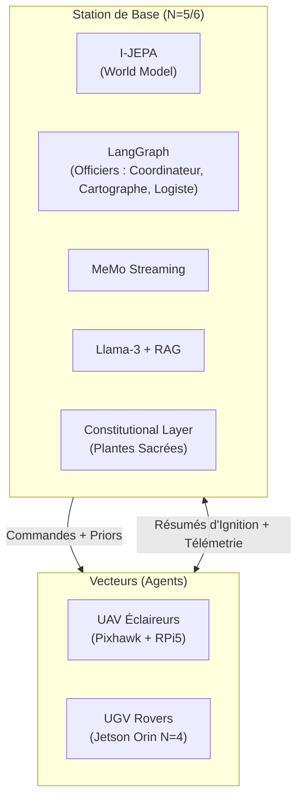
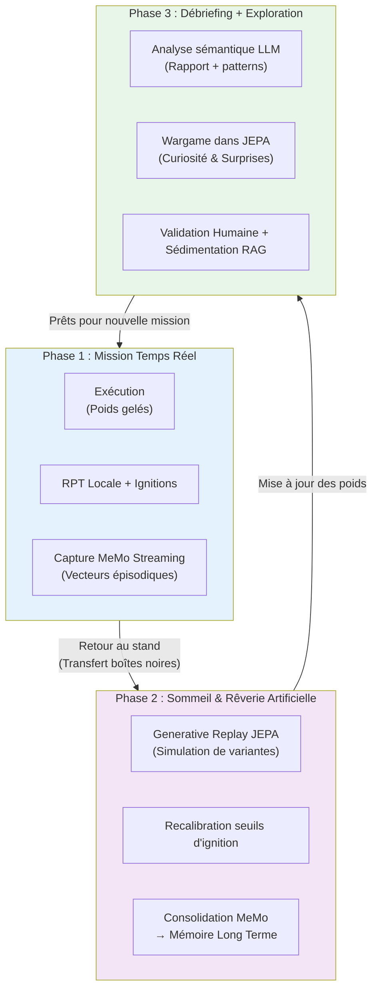

## Spécifications du Projet MVP : Opération GARRIGUE-X

Pour valider cette architecture sans les coûts d'infrastructure du domaine aéronautique, nous déployons un projet sur 12 mois dans un univers compétitif réel et complexe : **la garrigue méditerranéenne**.

### A. Le "Monde-Jeu" et les Règles

**Le Terrain :** Un hectare de terrain naturel accidenté (pierres, buissons denses, ruptures de pente).

**Les Minéraux :** Des blocs de béton cellulaire (Siporex) identifiés par des marqueurs géométriques *ArUco* durcis.

**L'Objectif :** Deux équipes de robots s'affrontent pour collecter ces blocs et les empiler afin de construire une ligne de muraille continue protégeant leur base.

**Le Prior Sacré (La Constitution) :** Au centre du terrain se trouvent des **Plantes Sacrées** (pots de fleurs équipés de capteurs de pression piézo-électriques). Tout dommage infligé à une plante entraîne l'élimination immédiate de l'équipe.

**Pourquoi ce cadre est pertinent :** Il instancie, à échelle humaine, les problèmes fondamentaux du SoS réel — allocation de ressources sous contrainte, robustesse aux pertes, décision distribuée, respect de contraintes constitutionnelles non-négociables. La plante est le droit des conflits armés du pauvre.

---

### B. Matériel et Stack Technologique



#### 1. Les Vecteurs (Les Agents)

**Aériens (UAV — Éclaireurs) :** Quadricoptères légers open-source (Contrôleur Pixhawk + Raspberry Pi 5). Capteurs : Caméra standard + Flux optique. Rôle : Cartographie latente, repérage des blocs, envoi de résumés topologiques au QG.

**Terrestres (UGV — Ouvriers / Défenseurs) :** Châssis Rover RC tout-terrain à chenilles.

| Couche | Matériel | Architecture | Rôle |
|---|---|---|---|
| N=0/N=1 | Teensy 4.1 | PID + MLP nano | Gestion couple moteurs, adaptation patinage |
| N=2/N=3 | Jetson Nano | Mamba embarqué (RPT locale) | Prédiction dynamique, obstacles, SLAM local |
| N=4 | Jetson Orin (Wi-Fi) | JEPA-S + Workspace mini | Conscience de vecteur, état dégradé, workarounds |

**Actionneurs :** Pince servomoteur pour saisir et déplacer les blocs de Siporex. Chaque servo a son propre modèle MLP nano de contrôle de couple.

#### 2. La Station de Base (Le QG Terrain)

**Matériel :** Station de calcul durcie (PC fixe avec GPU dédié, alimentée par groupe électrogène).

**Logiciel (N=5/N=6) :**

| Composant | Rôle dans l'architecture |
|---|---|
| I-JEPA (GPU) | Modèle du monde centralisé, workspace N=5 |
| [LangGraph](https://github.com/langchain-ai/langgraph) modifié | Framework multi-agents, gestion des officiers |
| MeMo streaming | Capture et compression des ignitions de terrain |
| Llama-3-8B (RAG) | Interface N=6, dialogue opérateur humain |
| Constitutional layer | Contrainte dure : plante ≠ touchée, quelle que soit l'optimisation |

**Les "Officiers" du MVP :** Version simplifiée à 3 rôles distincts avec profils de saillance différents.

```
     [COORDINATEUR (Capitaine)]
      ↑ résumés  ↓ priors
┌───────────┬───────────┐
│CARTOGRAPHE│LOGISTE    │
│(Science)  │(Ingénieur)│
│Saillance :│Saillance :│
│anomalies  │ressources │
│topologie  │pannes     │
└───────────┴───────────┘
```

---

### C. Le Cycle d'Apprentissage en 3 Phases (La Triple Boucle Biologique)

Le système suit un cycle inspiré de la biologie : **éveil → sommeil → débriefing**, qui garantit à la fois la stabilité en mission et l’adaptation continue.



**Détail des phases :**

**Phase 1 – Mission** : Les poids neuronaux sont gelés pour garantir la stabilité et la prédictibilité. Seules les boucles RPT locales s’adaptent en temps réel. Chaque ignition est capturée par MeMo avec son contexte et son score de saillance.

**Phase 2 – Sommeil & Rêverie** : C’est le cœur de l’apprentissage continu. Le modèle JEPA rejoue les trajectoires significatives dans son espace latent (sans risque matériel). Il génère des variantes ("et si ?"), recalibre les seuils d’ignition, et consolide les expériences importantes dans la mémoire long terme via MeMo.

**Phase 3 – Débriefing + Jeu** : Analyse sémantique par le LLM, identification de patterns, et surtout **exploration par curiosité** via des wargames auto-générés dans l’espace latent JEPA. Les tactiques prometteuses sont validées par l’humain puis injectées dans le RAG doctrinal.

**Rôle de la Constitutional Layer :** À chaque phase (surtout pendant la rêverie et la consolidation), un module indépendant et non modifiable vérifie que les contraintes fondamentales (ex. : ne jamais endommager les plantes sacrées) restent intactes.

Ce cycle transforme le système d’un simple exécutant en une entité qui **apprend vraiment** de son expérience, tout en maintenant une identité stable et une robustesse éthique.

---

## 4. Appel à Compétences : Rejoindre l'Équipe GARRIGUE-X

Ce projet n'est pas une démonstration logicielle classique sur simulateur. C'est une aventure d'ingénierie brute où le code rencontre la poussière, le soleil aveuglant de la garrigue et les pannes matérielles imprévues. Nous recherchons des profils pointus, prêts à s'investir pour repousser les limites de la robotique autonome distribuée :

**Ingénieurs Automatique & Robotique (N=0/N=1/N=2) :** Experts en asservissement, filtres de Kalman, et micro-noyaux temps réel. Vous concevrez les réflexes de survie des rovers lorsque les roues patineront sur la roche friable.

**Chercheurs en Machine Learning (N=3/N=4/N=5) :** Spécialistes des architectures SSM (Mamba, RWKV), du Reinforcement Learning basé sur la motivation intrinsèque, des architectures JEPA, et de la mémoire épisodique continue (MeMo). Vous créerez le moteur de rêve de nos machines.

**Neuroscientifiques / Psychologues Cognitifs :** Pour valider et affiner les profils fonctionnels des modules, les seuils d'ignition, et la modélisation computationnelle des traits de personnalité. La frontière RPT/GNWT a besoin d'être calibrée expérimentalement sur notre plateforme.

**Architectes Logiciels & LLM Ops (N=6) :** Experts en systèmes distribués, architectures multi-agents et pipelines RAG. Vous construirez la Constitutional Layer — le système immunitaire cognitif qui empêchera nos robots d'écraser la plante sacrée par pure curiosité optimisée.

**Éthiciens et juristes spécialisés IA/défense :** La Constitutional Layer n'est pas un détail technique — c'est le problème central. Nous avons besoin de personnes capables de traduire des contraintes légales et éthiques en contraintes mathématiques sur des espaces latents. Ce n'est pas un poste honorifique.

---

**Le livrable attendu dans 12 mois est clair :** une meute de robots capables de s'adapter seuls à la destruction de l'un de leurs membres, de reconfigurer leurs lois de comportement en une nuit de rêve artificiel, de remporter le wargame face à une équipe adverse — sous le contrôle stratégique d'un opérateur humain, et sans jamais toucher la plante.

Le tout en garrigue. Sous le soleil. Sans air conditionné.

*Harry Tuttle, plombier.*